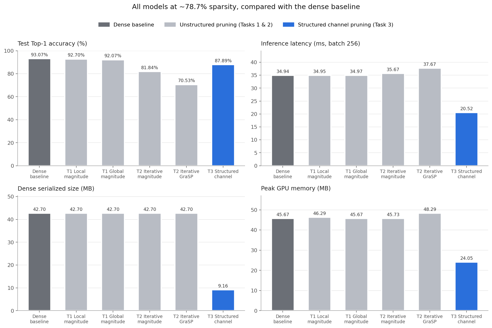
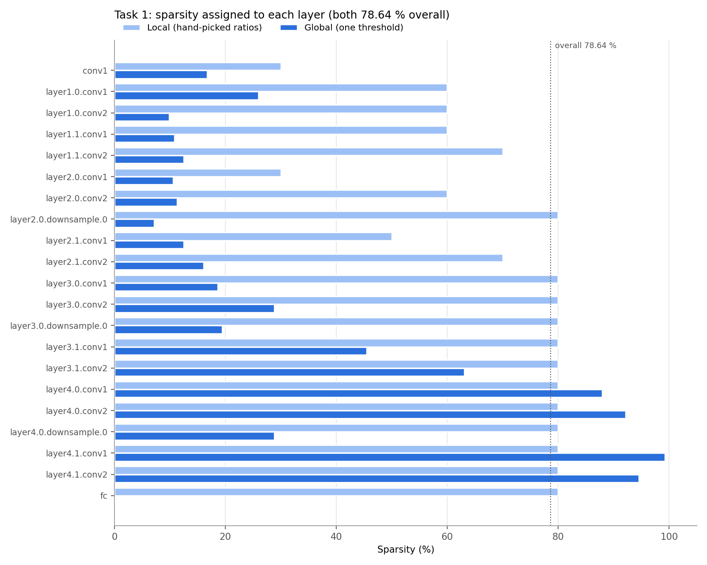
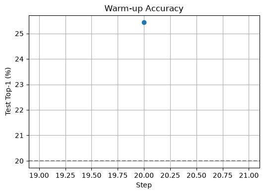
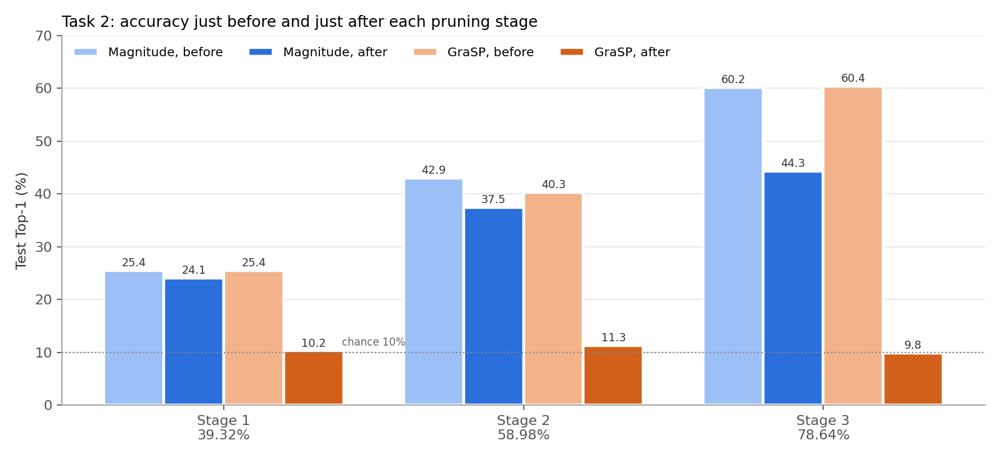
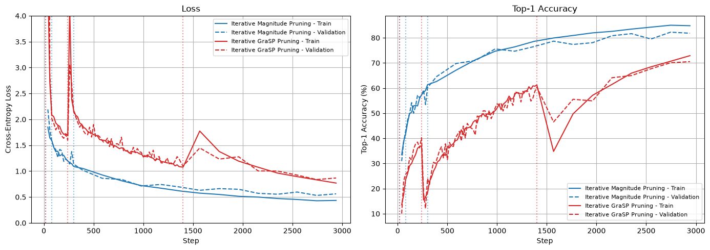
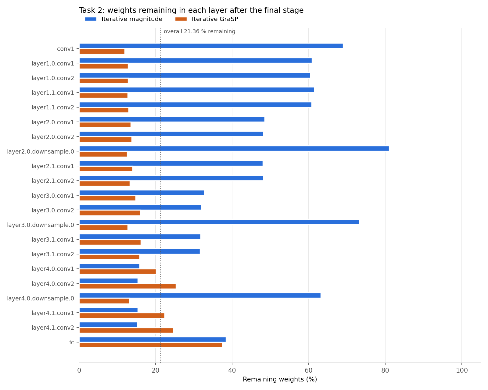
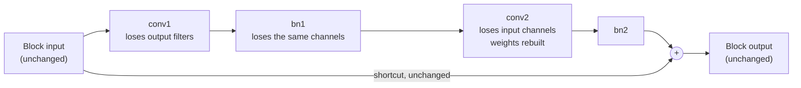

<h1 align="center">Pruning ResNet-18 on CIFAR-10</h1>

<h3 align="center">AI624 AI on Edge Devices · Programming Assignment 2 · Report</h3>

<b>Student:</b> <i>Muhammad Ahmad </i> · <b>Roll No.:</b> 25280065

---

## Summary

This report studies three ways of pruning a ResNet-18 trained on CIFAR-10 and measures what each one really gains on hardware. All pruned models remove about **78.7 %** of the convolution and linear weights, so they can be compared fairly.

| Method | Test Top-1 | Change vs dense | Latency | Peak GPU memory | Model size |
|---|---:|---:|---:|---:|---:|
| Dense baseline (Task 0) | **93.07 %** | – | 34.94 ms | 45.67 MB | 42.70 MB |
| Local magnitude + fine-tune (Task 1) | 92.70 % | −0.37 pp | 34.95 ms | 46.29 MB | 18.27 MB (COO) |
| Global magnitude + fine-tune (Task 1) | 92.07 % | −1.00 pp | 34.97 ms | 45.67 MB | 18.27 MB (COO) |
| Iterative magnitude, from scratch (Task 2) | 81.84 % | −11.23 pp | 35.67 ms | 45.73 MB | 18.27 MB (COO) |
| Iterative GraSP, from scratch (Task 2) | 70.53 % | −22.54 pp | 37.67 ms | 48.29 MB | 18.27 MB (COO) |
| **Structured channel pruning (Task 3)** | **87.89 %** | **−5.18 pp** | **20.52 ms** | **24.05 MB** | **9.16 MB** |

  

**Main findings**

1. **Pruning a trained network weight by weight costs almost no accuracy.** 78.64 % of weights can be removed for a loss of only 0.37 pp (local) or 1.00 pp (global) after fine-tuning.
2. **Zero weights do not make the model faster.** Unstructured pruning leaves every tensor at its full size, and the GPU still multiplies the zeros, so latency and memory stay the same as the dense model.
3. **Pruning during training from scratch is much harder** within a 15-epoch budget, and GraSP performed worse than simple magnitude pruning when used during training.
4. **Only structured (channel) pruning gives real gains:** 1.7× faster, 47 % less GPU memory and 4.7× smaller, with a 5.18 pp accuracy drop that is inside the allowed 5–15 pp.

---

## Contents

1. [Experimental Setup](#1-experimental-setup)
2. [Task 0: Baseline Model](#2-task-0-baseline-model)
3. [Task 1: Unstructured Post-Training Pruning](#3-task-1-unstructured-post-training-pruning)
4. [Task 2: Saliency-Based Iterative Pruning](#4-task-2-saliency-based-iterative-pruning)
5. [Task 3: Structured Channel Pruning](#5-task-3-structured-channel-pruning)
6. [Overall Comparison and Conclusions](#6-overall-comparison-and-conclusions)
7. [Limitations](#7-limitations)
8. [Generative-AI Acknowledgment](#8-generative-ai-acknowledgment)

---

## 1. Experimental Setup

| Setting | Value |
|---|---|
| Model | ResNet-18 from [huyvnphan/PyTorch_CIFAR10](https://github.com/huyvnphan/PyTorch_CIFAR10) (`cifar10_models/resnet.py`, checkpoint `resnet18.pt`) |
| Dataset | CIFAR-10: 50,000 training images, 10,000 test images, 10 classes |
| Input resolution | 32 × 32 × 3 |
| Batch size | 256 for training, evaluation and profiling |
| Normalisation | mean (0.4914, 0.4822, 0.4465), std (0.2471, 0.2435, 0.2616) |
| Training augmentation | Random crop (32, padding 4) and random horizontal flip |
| Test augmentation | None |
| Hardware | Apple Silicon GPU through the PyTorch MPS backend |
| Prunable layers | 20 convolutions + 1 linear layer = 21 layers, **11,164,352** weights |
| Never pruned | Biases and BatchNorm parameters |

**Profiling procedure (identical for every model)**

| Metric | How it was measured |
|---|---|
| Accuracy | Top-1, Top-5 and Macro-F1 on the full train and test sets |
| Size | Serialized `state_dict` size; for sparse models also the COO size including indices |
| MACs / FLOPs | `thop.profile` on one 32 × 32 image; FLOPs = 2 × MACs |
| Effective MACs | MACs that multiply a non-zero weight (thop also counts zeros) |
| Latency | Average over 50 batches after 10 warm-up batches, with device synchronisation |
| GPU memory | Allocated MPS memory over 50 batches, average and peak, other resident models subtracted |
| Energy | Not available: the PyTorch MPS backend exposes no energy counters (see Task 0 note in the notebook) |

---

## 2. Task 0: Baseline Model

The pretrained checkpoint loaded without missing or unexpected keys and reached the expected accuracy.

| Metric | Value |
|---|---:|
| Train Top-1 | 99.76 % |
| Test Top-1 | **93.07 %** |
| Test Top-5 | 99.74 % |
| Macro-F1 | 0.9307 |
| Parameters | 11,173,962 (11.17 M) |
| Serialized size | 42.70 MB |
| MACs | 141.00 M |
| FLOPs | 282.00 M |
| Average latency (batch 256) | 34.94 ms |
| Peak / average GPU memory | 45.67 MB / 45.67 MB |
| CPU / GPU energy | N/A (MPS) |

The first latency measurement (67.79 ms) came from an earlier session. For a fair comparison the baseline was re-profiled in Task 1 Part 7 together with all other models, and **34.94 ms** is used everywhere in this report.

---

## 3. Task 1: Unstructured Post-Training Pruning

### 3.1 Method

Each prunable layer $\ell$ has a binary mask of the same shape as its weights. A mask value of 0 removes a weight:

$$
W^{(\ell)} \leftarrow M^{(\ell)} \odot W^{(\ell)}, \qquad M^{(\ell)} \in \{0,1\}^{\text{shape}(W^{(\ell)})}
$$

For magnitude pruning, the importance of a weight is its absolute value, and the smallest weights are removed:

$$
I^{(\ell)}_i = \big|W^{(\ell)}_i\big|
$$

The overall sparsity counts all eligible weights together:

$$
s_{\text{overall}} = 1 - \frac{\sum_\ell \lVert M^{(\ell)} \rVert_0}{\sum_\ell N_\ell}
$$

### 3.2 Layer-wise sensitivity analysis

Each of the 21 layers was pruned **on its own** at 0, 10, 20, 50, 70, 80 and 90 % sparsity, starting every time from the original dense checkpoint and without fine-tuning.

| Layer | Weights | Top-1 at 70 % | Top-1 at 80 % | Top-1 at 90 % | Sensitivity |
|---|---:|---:|---:|---:|---|
| conv1 | 1,728 | 79.21 % | 42.24 % | **22.15 %** | Very high |
| layer2.0.conv1 | 73,728 | 91.98 % | 88.46 % | **62.78 %** | High |
| layer2.1.conv1 | 147,456 | – | – | 83.36 % | Medium |
| layer2.0.conv2 | 147,456 | 92.57 % | 91.86 % | 87.93 % | Medium |
| layer1.*.conv* | 36,864 each | ≈ 92.3–92.9 % | ≈ 91–92.5 % | 88.4–91.5 % | Medium |
| layer3.* | 32,768–589,824 | – | – | 91.1–93.0 % | Low |
| layer4.*, fc | 5,120–2,359,296 | – | – | 92.95–93.09 % | Almost none |

**What this shows:** the first convolution is by far the most fragile. It has only 1,728 weights and every image passes through it, so each weight matters. The large `layer3` and `layer4` convolutions hold 94 % of all weights but are highly redundant, so they can be pruned heavily.

### 3.3 Local and global magnitude pruning

- **Local pruning:** a separate ratio per layer, chosen from the sensitivity curves: 30 % for `conv1` and `layer2.0.conv1`, 50–70 % for the other early layers, and 80 % for `layer3`, `layer4` and `fc`.
- **Global pruning:** one magnitude threshold for all 21 layers together, set so that the overall sparsity is exactly the same (**78.64 %**).

| Model | Overall sparsity | Train Top-1 | Test Top-1 | Test Top-5 | Macro-F1 |
|---|---:|---:|---:|---:|---:|
| Dense baseline | 0.00 % | 99.76 % | 93.07 % | 99.74 % | 0.9307 |
| Local pruning (no fine-tuning) | 78.64 % | 95.02 % | 88.85 % | 99.24 % | 0.8889 |
| Global pruning (no fine-tuning) | 78.64 % | 99.74 % | **93.11 %** | 99.75 % | 0.9312 |

Global pruning keeps the dense accuracy **without any fine-tuning**, while local pruning loses 4.22 pp. The chart explains why: the single threshold automatically prunes the late `layer4` convolutions by 88–99 % and leaves the sensitive early layers at 7–29 % and `fc` at 0.12 %. The hand-picked local ratios pruned the early layers much more than necessary. **No layer was fully pruned**; the closest is `layer4.1.conv1` at 99.21 %.

### 3.4 Fine-tuning with fixed masks

Both models were fine-tuned with the same settings: 10 epochs, SGD (lr 0.01, momentum 0.9, weight decay 5e-4), cosine learning-rate schedule, batch size 256 and seed 42. After **every** optimizer step the masks were re-applied, $W^{(\ell)} \leftarrow M^{(\ell)} \odot W^{(\ell)}$. The test set was used as the validation set.

| Model | Before fine-tuning | After fine-tuning | Change | Test Top-5 | Macro-F1 |
|---|---:|---:|---:|---:|---:|
| Local pruning | 88.85 % | **92.70 %** | **+3.85 pp** | 99.75 % | 0.9270 |
| Global pruning | 93.11 % | 92.07 % | −1.04 pp | 99.73 % | 0.9207 |

Both models first drop to about 75 % after epoch 1, because a learning rate of 0.01 is large for an already-trained network. Accuracy then climbs steadily as the cosine schedule lowers the learning rate, and the validation loss falls every epoch (to 0.258 and 0.261). Both final models are within about 1 pp of the dense baseline.

### 3.5 Mask verification

For every one of the 21 layers of both models:

| Check | Local | Global |
|---|:-:|:-:|
| Sparsity from the mask = sparsity measured from the weight tensor | Pass | Pass |
| Number of non-zero values in pruned positions after fine-tuning | **0** | **0** |

The masks stayed fixed during training, and every pruned weight is still exactly zero.

### 3.6 Sparse COO storage

The fine-tuned weights were converted to COO format with `torch.sparse` and saved with their values, indices, tensor shapes and pruning masks. Default PyTorch COO stores one int64 index per dimension, so a 4-D convolution weight costs

$$
\underbrace{4}_{\text{float32 value}} + \underbrace{4 \times 8}_{\text{4 int64 indices}} = 36 \text{ bytes per non-zero} \quad\text{vs.}\quad 4 \text{ bytes dense.}
$$

COO therefore only saves space when the density is below $4/36 \approx 11\,\%$. Our models keep 21.36 % of their weights, so default COO is **larger** than dense. Storing one flattened int32 index per non-zero weight reduces the cost to 8 bytes per non-zero.

| Model | Dense weights | Default COO | Compact COO (int32 index) | Restores weights exactly |
|---|---:|---:|---:|:-:|
| Local | 42.59 MB | 81.86 MB (92.22 % larger) | **18.20 MB (57.28 % smaller)** | Yes |
| Global | 42.59 MB | 81.79 MB (92.06 % larger) | **18.19 MB (57.28 % smaller)** | Yes |

### 3.7 Sparse inference and profiling

Two versions of each pruned model were profiled: the **dense masked** model (zeros stored as normal values) and the **COO** model. PyTorch has no sparse convolution kernel, so **the COO convolution weights are converted back to dense before every `F.conv2d` call**. The linear layer uses sparse matrix multiplication (`torch.sparse.mm`).

| Model | Train Top-1 / Top-5 | Test Top-1 / Top-5 | Macro-F1 | Dense size | Sparse size incl. indices | MACs / FLOPs | Effective MACs | Latency | Peak / avg GPU mem |
|---|---:|---:|---:|---:|---:|---:|---:|---:|---:|
| Dense baseline | 99.74 / 99.99 % | 93.07 / 99.74 % | 0.93 | 42.70 MB | – | 141 M / 282 M | 140.19 M | 34.94 ms | 45.67 / 45.67 MB |
| Local, dense masked | 98.83 / 99.99 % | 92.70 / 99.75 % | 0.93 | 42.70 MB | 18.27 MB | 141 M / 282 M | 43.55 M | 34.95 ms | 46.29 / 46.29 MB |
| Global, dense masked | 98.17 / 99.98 % | 92.07 / 99.73 % | 0.92 | 42.70 MB | 18.27 MB | 141 M / 282 M | 84.80 M | 34.97 ms | 45.67 / 45.67 MB |
| Local, sparse COO | 98.82 / 99.99 % | 92.70 / 99.75 % | 0.93 | 42.70 MB | 18.27 MB | 141 M / 282 M | 43.55 M | 37.05 ms | 88.32 / 88.32 MB |
| Global, sparse COO | 98.14 / 99.98 % | 92.07 / 99.73 % | 0.92 | 42.70 MB | 18.27 MB | 141 M / 282 M | 84.80 M | 36.90 ms | 87.71 / 87.71 MB |

CPU and GPU energy: N/A (MPS backend).

**Observations**

- The COO models give **exactly** the same accuracy as the dense masked models, so the conversion is lossless.
- `thop` reports 141 M MACs for every model because it counts multiplications by zero. The **effective** MACs drop to 43.55 M (local) and 84.80 M (global). Global pruning keeps the early layers dense, and those layers run on the largest 32 × 32 feature maps, so it performs about twice as much real work as local pruning at the same sparsity.
- Latency does not improve, and COO is even a little slower and uses almost twice the GPU memory because of its int64 indices and the sparse-to-dense conversion.

### 3.8 Discussion

**Which layers were the most sensitive to pruning?**
`conv1` was by far the most sensitive (93.07 % → 22.15 % at 90 % sparsity), followed by `layer2.0.conv1` (62.78 %), `layer2.1.conv1` (83.36 %) and `layer2.0.conv2` (87.93 %). The `layer1` convolutions fell to about 88–91 %. `layer3`, `layer4` and `fc` stayed at 91 % or higher even at 90 % sparsity, because they contain most of the parameters and are highly redundant.

**Did global pruning produce a reasonable layer-wise sparsity distribution?**
Yes. A single threshold removed most weights from the large, insensitive `layer4` convolutions (88–99 %) and few from the sensitive early layers (7–29 %) and `fc` (0.12 %). This matches the sensitivity analysis almost exactly, and the global model kept 93.11 % accuracy before fine-tuning. No layer was fully pruned, although `layer4.1.conv1` (99.21 %) is close to it.

**How much accuracy was recovered through fine-tuning?**
Local pruning recovered **+3.85 pp** (88.85 % → 92.70 %). Global pruning had nothing to recover (93.11 %) and changed by −1.04 pp (→ 92.07 %), because the learning rate of 0.01 disturbed an already well-tuned model. Both final models are within about 1 pp of the dense baseline, far inside the 5–15 pp budget.

**Did COO storage reduce the actual model size?**
Not with default PyTorch COO: 36 bytes per non-zero made it 92 % **larger** (81.86 MB vs 42.59 MB). It only pays off below about 11 % density. With one flattened int32 index per non-zero, storage fell to 18.20 MB, a **57.28 % reduction**, while restoring every weight exactly.

**Why can a model with many zero weights still have nearly the same latency as the dense model?**
The dense GPU kernels multiply every element, including the zeros, so unstructured zeros save no computation (latency 34.95 ms vs 34.94 ms). The zeros are scattered randomly, so the hardware cannot skip them without extra index work. PyTorch also has no sparse convolution kernel, so the COO weights must be rebuilt as dense tensors before each convolution, which adds time (37 ms). Real speed-ups need **structured** sparsity (Task 3) or hardware-supported patterns such as 2:4 semi-structured sparsity.

---

## 4. Task 2: Saliency-Based Iterative Pruning

### 4.1 Method

A ResNet-18 from the same repository was created with **random weights** (`resnet18(pretrained=False)`) and trained from scratch. Pruning is applied gradually in three stages while the model trains. Two ranking criteria were compared under identical conditions:

| | Iterative magnitude | Iterative GraSP |
|---|---|---|
| Removes | Weights with the smallest $\lvert\theta\rvert$ | Weights with the largest GraSP score $S$ |
| Needs data | No | Yes, a calibration set |
| Idea | Small weights matter least | Remove weights whose loss least reduces gradient flow |

**GraSP score** (Wang et al., 2020, Algorithm 1). For a calibration batch with loss $L(\theta)$:

$$
g = \nabla_\theta L(\theta), \qquad
Hg = \nabla^2_\theta L(\theta)\, g, \qquad
S_i = -\,\theta_i\,(Hg)_i
$$

The Hessian is **never built**. $Hg$ is obtained by differentiating twice with `torch.autograd.grad`:

$$
Hg = \nabla_\theta\!\left( g_{\text{fixed}}^{\top}\, \nabla_\theta L(\theta) \right)
$$

where $g_{\text{fixed}}$ is the gradient averaged over the calibration batches and treated as a constant. As in the paper, the logits are divided by a temperature $T = 200$, and the weights with the **highest** scores are removed. Biases and BatchNorm parameters are never scored or pruned.

**Global ranking and cumulative masks.** At each stage all convolution and linear weights are ranked together. Weights pruned in an earlier stage are given a score of $+\infty$ so they are always removed again, which gives the cumulative mask

$$
M^{(\ell)}_{\text{cum},k} = M^{(\ell)}_{\text{cum},k-1} \odot M^{(\ell)}_k .
$$

The mask is re-applied after **every** optimizer step. Before each mask was built, a check confirmed that every removed weight ranked at or above every kept weight (the sorting direction was correct at all six stages).

**Schedule** with final target $s^\star = 78.64\,\%$:

**Identical conditions for both methods**

| Setting | Value |
|---|---|
| Initial weights | Same seed (42); both methods load the same warm-up checkpoint and optimizer state |
| Final target sparsity | 78.64 % |
| Training budget | 15 epochs (2,940 optimizer steps, including warm-up) |
| Optimizer | SGD, momentum 0.9, weight decay 5e-4 |
| Learning-rate schedule | Constant 0.05 |
| Batch size | 256 |
| Stage trigger | Test accuracy checked every 20 steps |

### 4.2 Warm-up and calibration set

The random model reached **25.44 %** test accuracy after 20 steps (4.6 s). The initial weights, the warm-up checkpoint, the optimizer state and the warm-up curve were saved (`task2_initial_weights.pt`, `task2_warmup_checkpoint.pt`).

| Calibration set | Value |
|---|---|
| Number of calibration samples | 320 random training images (no augmentation) |
| Calibration batch size | 64 |
| Number of batches | 5 |
| Gradient accumulation | Gradients and $Hg$ averaged over the 5 batches |

### 4.3 Accuracy and sparsity at every pruning stage

| Stage | Sparsity after stage | Magnitude: step | Magnitude: before → after | GraSP: step | GraSP: before → after | GraSP criterion time |
|:-:|---:|---:|---|---:|---|---:|
| 1 | 39.32 % | 20 | 25.44 % → 24.08 % | 20 | 25.44 % → 10.25 % | 1.43 s |
| 2 | 58.98 % | 80 | 42.94 % → 37.45 % | 240 | 40.27 % → 11.26 % | 0.92 s |
| 3 | 78.64 % | 300 | 60.18 % → 44.28 % | 1400 | 60.41 % → 9.82 % | 0.93 s |

All stage targets were reached (none had to be forced) and the sorting check passed every time. Magnitude pruning loses only 1–16 pp at each cut. **Every GraSP cut drops the model to chance level (about 10 %)**, so GraSP needed 1,400 steps to reach the third stage, compared with 300 steps for magnitude pruning.

### 4.4 Training and validation curves

The dotted vertical lines mark the pruning stages. After each GraSP cut the validation loss spikes (up to 16.25 right after stage 1) and accuracy collapses, then both recover. Because GraSP reached its final sparsity so late, it trained for only 1,540 steps at 78.64 % sparsity, compared with 2,640 steps for magnitude pruning. At the end, train and validation accuracy are close for both methods (84.13 / 81.84 % and 71.25 / 70.53 %), which shows the models are **still underfitting**, not overfitting.

### 4.5 Layer-wise remaining-weight ratio

| Pattern | Iterative magnitude | Iterative GraSP |
|---|---|---|
| Early layers (`conv1`, `layer1`) | 61–69 % kept | 12–13 % kept |
| Shortcut (downsample) layers | 63–81 % kept | 13 % kept |
| `layer4` convolutions | 15–16 % kept | 20–25 % kept |
| Lowest layer | `layer4.1.conv2`: 15.25 % | `conv1`: 11.92 % |
| Collapsed layers (< 1 % kept) | None | None |

Magnitude pruning follows the same pattern as the sensitivity analysis: it protects the small early layers and prunes the large late ones. GraSP prunes almost **uniformly** (12–16 %) across the early and middle layers, and keeps only 206 of the 1,728 weights in `conv1`, the most sensitive layer found in Task 1. Both mask checks passed: all pruned weights were still zero at the end of training.

### 4.6 Final results

The final pruned models were converted to COO format and profiled with the same procedure as Task 1.

| Method | Train Top-1 / Top-5 | Test Top-1 / Top-5 | Macro-F1 | Dense size | Sparse size incl. indices | Effective MACs | Latency (dense masked / COO) | Peak = avg GPU mem (dense masked / COO) | Criterion time (total) |
|---|---:|---:|---:|---:|---:|---:|---:|---:|---:|
| Task 1 local magnitude | 98.83 / 99.99 % | 92.70 / 99.75 % | 0.93 | 42.70 MB | 18.27 MB | 43.55 M | 34.95 / 37.05 ms | 46.29 / 88.32 MB | – |
| Task 1 global magnitude | 98.17 / 99.98 % | 92.07 / 99.73 % | 0.92 | 42.70 MB | 18.27 MB | 84.80 M | 34.97 / 36.90 ms | 45.67 / 87.71 MB | – |
| Iterative magnitude | 84.13 / 99.43 % | **81.84** / 99.17 % | 0.82 | 42.70 MB | 18.27 MB | 56.89 M | 35.67 / 37.19 ms | 45.73 / 90.78 MB | **0.01 s** |
| Iterative GraSP | 71.25 / 97.90 % | 70.53 / 97.65 % | 0.70 | 42.70 MB | 18.27 MB | **22.78 M** | 37.67 / 37.79 ms | 48.29 / 89.25 MB | 3.28 s |

CPU and GPU energy: N/A (MPS backend).

### 4.7 Changes from the suggested schedule

| Change | Justification |
|---|---|
| First stage at 25.44 % instead of 20 % | Accuracy is checked every 20 steps and a random ResNet-18 passes 20 % within the first check |
| Test set used to trigger stages and as validation set | No separate validation split was held out; the same rule was used for both methods |
| Constant learning rate | Kept identical for both methods; a decaying schedule would likely raise both final accuracies |
| Max-pooling with `return_indices=True` in the GraSP scoring copy | `max_pool2d` is not twice-differentiable otherwise; the training model is unchanged |

### 4.8 Discussion

**Did iterative pruning outperform magnitude-based pruning?**
No. The Task 1 magnitude models reached 92.70 % and 92.07 %, while iterative magnitude reached 81.84 % and iterative GraSP 70.53 % at the same sparsity. This is mostly a difference in starting point and budget, not only in the pruning rule: Task 1 started from a fully trained network and only had to recover from one cut, while the iterative models had to learn CIFAR-10 from random weights in 15 epochs with a constant learning rate. The small gap between their train and test accuracy shows that they had not finished learning and would improve with a longer budget and a decaying learning rate.

**Did GraSP perform better than iterative magnitude pruning?**
No. GraSP finished **11.31 pp lower** (70.53 % vs 81.84 %; Macro-F1 0.70 vs 0.82) under identical conditions. Three reasons stand out:

- **Large drops at every cut.** GraSP ranks weights by their effect on gradient flow, not by size, so it also removes large weights that already store what the model has learned. Each cut sent the model back to about 10 %.
- **Less time at the final sparsity.** Recovering from these drops took much longer, so GraSP reached its final sparsity at step 1,400 instead of step 300.
- **Sensitive layers pruned hard.** GraSP kept only 11.92 % of `conv1`, while magnitude pruning kept 68.98 %.

GraSP was designed to prune **at initialization**, before any training. Used during training, its score does not protect knowledge the network has already acquired. Its advantages were the lowest effective MACs (22.78 M vs 56.89 M), at the cost of more time to compute the criterion (3.28 s vs 0.01 s in total).

**Did any layer collapse at high sparsity?**
No. Every layer kept more than 1 % of its weights under both methods. The most heavily pruned layers were GraSP `conv1` (11.92 % remaining) and the magnitude-pruned `layer4` convolutions (15.25–15.86 %). GraSP's aggressive pruning of `conv1` did not collapse it, but it likely contributed to GraSP's lower final accuracy.

---

## 5. Task 3: Structured Channel Pruning

### 5.1 Method

Instead of removing single weights, this task removes **whole channels**, following the regression-based method of He et al. (2017). Pruning starts from the same pretrained checkpoint as Tasks 0 and 1.

**What is pruned.** Each of the 8 residual blocks has two convolutions. We prune the **middle channels** between them:

Removing a middle channel deletes one output filter of `conv1`, its `bn1` entries, and the matching input slice of `conv2`. This handles the rule that pruning a layer's input channels requires pruning the previous layer's output channels. The block input and output channels are not changed, so **both branches of every residual addition keep matching sizes and channel order**, and no shortcut projection has to change. The stem convolution (the first convolutional block) and `fc` are not pruned, so pruning starts from the second convolutional block (`layer1.0`) and proceeds sequentially to `layer4.1`.

**Step 1: collect input–output pairs.** For the `conv2` of a block with weights $W \in \mathbb{R}^{n \times c \times k_h \times k_w}$ and input $X \in \mathbb{R}^{N \times c \times h \times w}$, the input is unfolded with `torch.nn.functional.unfold`:

$$
X_{\text{unf}} \in \mathbb{R}^{(N \cdot L) \times (c\, k_h k_w)}, \quad L = h_{\text{out}} w_{\text{out}}, \qquad
W_{\text{mat}} \in \mathbb{R}^{(c\, k_h k_w) \times n}, \qquad
Y = X_{\text{unf}} W_{\text{mat}}
$$

$X$ is taken from the current (already pruned) model and $Y$ from the original model, so each block also corrects errors made by earlier blocks. 128 calibration images were used, with 10 random output positions per image, giving 1,280 rows per regression.

**Step 2, subproblem (i): choose channels with LASSO.** With $Z_i = X_i W_i^{\top}$ for each middle channel $i$:

$$
\hat\beta = \arg\min_{\beta}\ \frac{1}{2N}\Big\lVert Y - \sum_{i=1}^{c} \beta_i Z_i \Big\rVert_F^2 + \lambda \lVert \beta \rVert_1
$$

The problem was solved with `sklearn.linear_model.Lasso` after normalising the columns. $\lambda$ starts at $0.1\,\lambda_{\max}$ and is halved until at least $c_0$ coefficients are non-zero; then the $c_0$ channels with the largest $|\beta_i|$ are kept.

**Step 3, subproblem (ii): rebuild the weights with least squares.**

$$
W' = \arg\min_{W'} \big\lVert Y - X' W'^{\top} \big\rVert_F^2, \qquad X' = [\beta_1 X_1, \dots, \beta_{c_0} X_{c_0}]
$$

This was solved with `torch.linalg.lstsq` and reshaped to $(n, c_0, k_h, k_w)$. The scaling by $\beta_i$ is absorbed into $W'$, so fitting on the kept channels gives the same solution.

### 5.2 Channel plan and pruning results

The ratios follow the Task 1 sensitivity analysis: the more sensitive early stages are pruned least and the redundant `layer4` most, chosen so that the overall sparsity matches Task 1.

| Block | Channels | Kept ($c_0$) | Channel sparsity | Non-zero β | Test Top-1 after this block |
|---|---:|---:|---:|---:|---:|
| layer1.0 | 64 | 32 | 50.00 % | 64 | 92.48 % |
| layer1.1 | 64 | 32 | 50.00 % | 64 | 91.52 % |
| layer2.0 | 128 | 51 | 60.16 % | 128 | 88.98 % |
| layer2.1 | 128 | 51 | 60.16 % | 127 | 83.52 % |
| layer3.0 | 256 | 64 | 75.00 % | 255 | 78.17 % |
| layer3.1 | 256 | 64 | 75.00 % | 145 | 78.57 % |
| layer4.0 | 512 | 87 | 83.01 % | 101 | 77.64 % |
| layer4.1 | 512 | 87 | 83.01 % | 93 | 77.77 % |

| Result | Value |
|---|---:|
| Conv + linear weights before | 11,164,352 |
| Conv + linear weights after | 2,377,472 |
| **Structured sparsity** | **78.70 %** (Task 1: 78.64 %) |
| Time per block | about 2 s |

Accuracy falls gradually as more blocks are pruned. Thanks to the least-squares reconstruction, the model still has **77.77 %** accuracy after losing 78.7 % of its weights, before any fine-tuning. For every block, LASSO returned at least as many non-zero $\beta$ values as channels to keep, so every kept channel was chosen by LASSO.

### 5.3 Fine-tuning

After all blocks were pruned, the smaller model was fine-tuned for 5 epochs with cross-entropy loss (SGD, lr 0.01, momentum 0.9, weight decay 5e-4, cosine schedule). No masks are needed, because the removed channels no longer exist.

| Stage | Test Top-1 |
|---|---:|
| Dense baseline | 93.07 % |
| After pruning all 8 blocks | 77.77 % |
| After 5 epochs of fine-tuning | **87.89 %** (+10.12 pp) |

Train and validation loss fall together every epoch and validation accuracy is still rising at epoch 5, so more epochs would likely recover more accuracy.

### 5.4 Profiling

No sparse library is needed, because the remaining filters are ordinary dense tensors.

| Model | Sparsity | Train Top-1 | Test Top-1 | Macro-F1 | Size | MACs | FLOPs | Latency | Peak / avg GPU mem |
|---|---:|---:|---:|---:|---:|---:|---:|---:|---:|
| Dense baseline | 0.00 % | 99.74 % | 93.07 % | 0.93 | 42.70 MB | 141.00 M | 282.00 M | 34.94 ms | 45.67 / 45.67 MB |
| Task 1 local magnitude | 78.64 % | 98.83 % | 92.70 % | 0.93 | 42.70 MB | 141.00 M | 282.00 M | 34.95 ms | 46.29 / 46.29 MB |
| Task 1 global magnitude | 78.64 % | 98.17 % | 92.07 % | 0.92 | 42.70 MB | 141.00 M | 282.00 M | 34.97 ms | 45.67 / 45.67 MB |
| Task 2 iterative magnitude | 78.64 % | 84.13 % | 81.84 % | 0.82 | 42.70 MB | 141.00 M | 282.00 M | 35.67 ms | 45.73 / 45.73 MB |
| Task 2 iterative GraSP | 78.64 % | 71.25 % | 70.53 % | 0.70 | 42.70 MB | 141.00 M | 282.00 M | 37.67 ms | 48.29 / 48.29 MB |
| **Task 3 structured channel** | **78.70 %** | **90.53 %** | **87.89 %** | **0.88** | **9.16 MB** | **49.92 M** | **99.85 M** | **20.52 ms** | **24.05 / 24.05 MB** |

CPU and GPU energy: N/A (MPS backend).

| Metric | Dense baseline | Task 3 | Change |
|---|---:|---:|---:|
| Test Top-1 | 93.07 % | 87.89 % | −5.18 pp (inside the 5–15 pp budget) |
| Model size | 42.70 MB | 9.16 MB | **−78.5 %** |
| MACs | 141.00 M | 49.92 M | **−64.6 %** |
| Latency | 34.94 ms | 20.52 ms | **−41.3 % (1.7× faster)** |
| Peak GPU memory | 45.67 MB | 24.05 MB | **−47.3 %** |

### 5.5 Discussion

**Did you see an improvement in performance (memory, latency) while meeting the accuracy constraint? Why or why not?**

**Yes.** Accuracy dropped by 5.18 pp, which is within the allowed 5–15 pp, while latency fell by 41 % and peak GPU memory by 47 %.

The reason is the difference between *zeros* and *removed channels*. Unstructured pruning (Tasks 1 and 2) only writes zeros into tensors that keep their full size, so the GPU still stores and multiplies them. Channel pruning makes every pruned convolution a **physically smaller dense tensor**: fewer filters to store, fewer multiplications to run, and thinner feature maps to keep in memory. Standard dense kernels benefit directly, without any special sparse library.

Latency fell less than the number of weights (41 % vs 79 %) for three reasons:

- **MACs fell only 64.6 %.** The early layers, which process the largest 32 × 32 feature maps, were pruned least (50 %), while `layer4`, pruned most (83 %), runs on tiny 4 × 4 maps.
- **Some work is untouched:** the stem convolution, shortcut convolutions, BatchNorm, ReLU and residual additions.
- **Fixed overhead:** small layers do not keep the GPU fully busy, and kernel-launch overhead does not shrink.

---

## 6. Overall Comparison and Conclusions

| Method | Starting point | Test Top-1 | Real speed-up | Real memory saving | Best use |
|---|---|---:|:-:|:-:|---|
| Global magnitude (Task 1) | Pretrained | 92.07 % | No | Only with compact storage | Compressing a trained model for storage |
| Local magnitude (Task 1) | Pretrained | 92.70 % | No | Only with compact storage | Same, with manual control per layer |
| Iterative magnitude (Task 2) | Random | 81.84 % | No | Only with compact storage | Training a sparse model from scratch |
| Iterative GraSP (Task 2) | Random | 70.53 % | No | Only with compact storage | Better suited to pruning at initialization |
| Structured channel (Task 3) | Pretrained | 87.89 % | **Yes, 1.7×** | **Yes, −47 %** | **Deployment on edge devices** |

**Conclusions**

1. **Sparsity alone is not speed.** All five unstructured models remove 78.64 % of the weights, yet none is faster than the dense model on a GPU. How weights are removed matters more than how many.
2. **Starting from a trained model helps a lot.** The post-training methods (Tasks 1 and 3) clearly beat the from-scratch methods (Task 2) with a similar number of training epochs.
3. **A saliency criterion must match when it is used.** GraSP is designed for untrained networks; applied during training it removed useful learned weights and underperformed simple magnitude pruning.
4. **For edge deployment, structured pruning is the practical choice.** It trades a few points of accuracy for real reductions in latency, memory and model size on standard hardware.

---

## 7. Limitations

- **Energy** could not be measured, because the PyTorch MPS backend exposes no CPU or GPU energy counters.
- The **test set** was also used as the validation set and to trigger the Task 2 pruning stages.
- The **Task 2 budget** (15 epochs, constant learning rate) is short for training from scratch; both iterative models were still improving.
- All results come from **one run with one seed**; small differences (for example the 0.6 pp between local and global pruning) may not be significant.
- Latency and memory were measured on **one Apple Silicon GPU**; the relative results can differ on other hardware such as CUDA GPUs with sparse tensor cores.

---

## 8. Generative-AI Acknowledgment

I have used Claude (Anthropic) to understand the assignment requirements and explore the concepts in depth, including GraSP, pruning, and channel-pruning algorithms. I also used it to understand implementation details and troubleshoot bugs in the notebook, such as figuring out how to measure energy consumption on a Mac, along with other implementation-related issues.

---

## References

1. S. Han, H. Mao, W. J. Dally. [Deep Compression: Compressing Deep Neural Networks with Pruning, Trained Quantization and Huffman Coding](https://arxiv.org/abs/1510.00149). ICLR 2016.
2. N. Lee, T. Ajanthan, P. H. S. Torr. [SNIP: Single-shot Network Pruning Based on Connection Sensitivity](https://arxiv.org/abs/1810.02340). ICLR 2019.
3. C. Wang, G. Zhang, R. Grosse. [Picking Winning Tickets Before Training by Preserving Gradient Flow](https://arxiv.org/abs/2002.07376). ICLR 2020.
4. A. Mishra et al. [Accelerating Sparse Deep Neural Networks](https://arxiv.org/abs/2104.08378). 2021.
5. G. Fang, X. Ma, M. Song, M. B. Mi, X. Wang. [DepGraph: Towards Any Structural Pruning](https://arxiv.org/abs/2301.12900). CVPR 2023.
6. Y. He, X. Zhang, J. Sun. [Channel Pruning for Accelerating Very Deep Neural Networks](https://arxiv.org/abs/1707.06168). ICCV 2017.
7. [huyvnphan/PyTorch_CIFAR10](https://github.com/huyvnphan/PyTorch_CIFAR10): pretrained CIFAR-10 models.
8. PyTorch documentation: [Sparse tensors](https://docs.pytorch.org/docs/stable/sparse.html), [Semi-structured sparsity](https://docs.pytorch.org/tutorials/advanced/semi_structured_sparse.html), [Profiler](https://docs.pytorch.org/docs/stable/profiler.html), [MPS backend](https://docs.pytorch.org/docs/stable/notes/mps.html).
