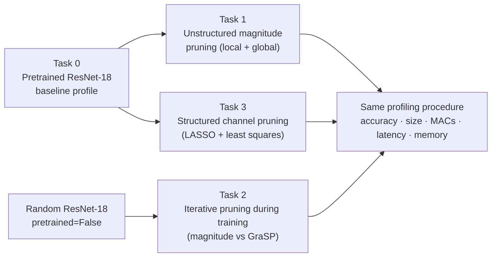
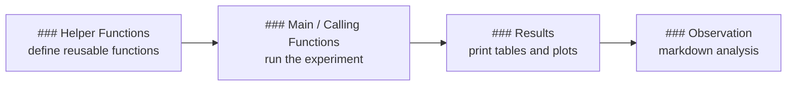
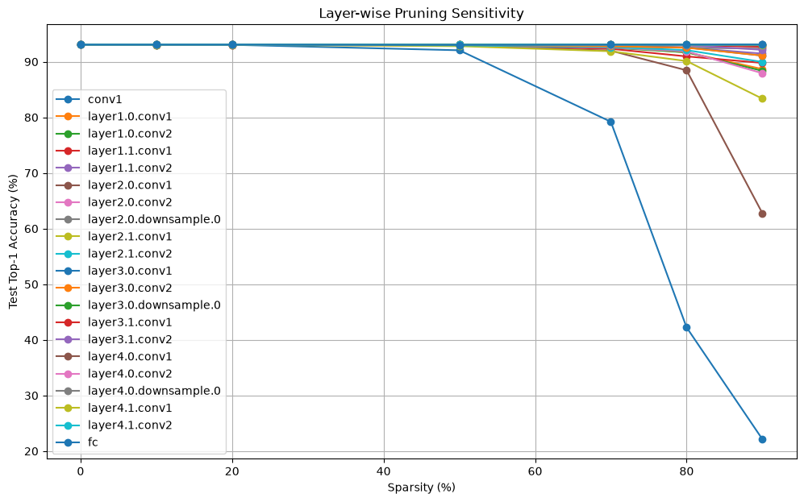
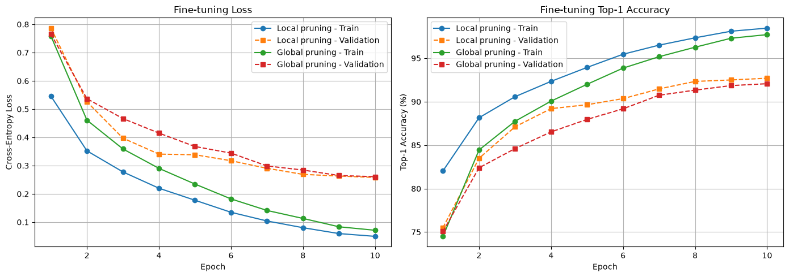
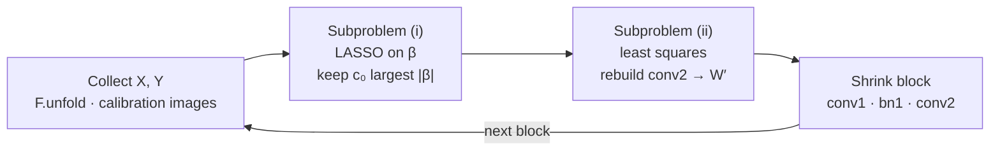
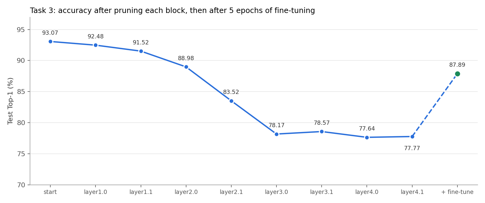
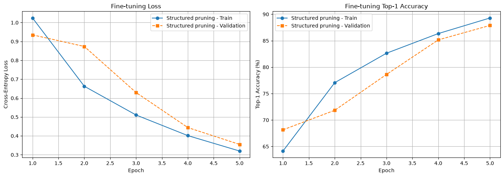

<h1 align="center">✂️ Pruning ResNet-18 on CIFAR-10</h1>

<h3 align="center">AI624 · AI on Edge Devices · Programming Assignment 2</h3>

<p align="center"><b>Unstructured, saliency-based and structured pruning of ResNet-18, profiled end-to-end on an Apple Silicon GPU</b></p>

<p align="center">
  
  
  
  
  
  
</p>

<p align="center"><b>Student:</b> <i>Muhammad Ahmad </i> · <b>Roll No.:</b> 25280065 · LUMS School of Science and Engineering</p>

---

## 📌 Results at a Glance

> Every pruned model below removes **~78.7 % of all convolution and linear weights**. Only **structured channel pruning (Task 3)** turns that sparsity into a real speed-up and memory saving.

| | Method | Test Top-1 | Δ vs dense | Latency | Peak GPU mem | Size |
|:-:|---|---:|---:|---:|---:|---:|
| 🟦 | **Dense baseline** (Task 0) | **93.07 %** | – | 34.94 ms | 45.67 MB | 42.70 MB |
| 1 | Local magnitude + fine-tune (Task 1) | 92.70 % | −0.37 pp | 34.95 ms | 46.29 MB | 42.70 MB* |
| 2 | Global magnitude + fine-tune (Task 1) | 92.07 % | −1.00 pp | 34.97 ms | 45.67 MB | 42.70 MB* |
| 3 | Iterative magnitude, from scratch (Task 2) | 81.84 % | −11.23 pp | 35.67 ms | 45.73 MB | 42.70 MB* |
| 4 | Iterative GraSP, from scratch (Task 2) | 70.53 % | −22.54 pp | 37.67 ms | 48.29 MB | 42.70 MB* |
| ⭐ | **Structured channel pruning (Task 3)** | **87.89 %** | **−5.18 pp** | **20.52 ms** | **24.05 MB** | **9.16 MB** |

<sub>* Dense-masked storage. Stored as compact COO (float32 values + int32 indices) the unstructured models take **18.27 MB**.</sub>

<p align="center">
  
</p>

**Key takeaways**

- 🎯 **Magnitude pruning after training is almost free in accuracy:** 78.64 % of weights removed for a loss of only 0.37 pp (local) and 1.00 pp (global).
- 🐢 **Unstructured zeros do not make the model faster:** the dense MPS kernels still multiply every zero, so latency stays at ~35 ms.
- 🧠 **GraSP was not a good fit for pruning during training:** every GraSP cut dropped accuracy to chance level (~10 %), and it finished 11.31 pp below iterative magnitude.
- 🚀 **Structured pruning gives real gains:** it is **1.7× faster**, uses **47 % less GPU memory** and is **4.7× smaller**, while staying inside the 5–15 pp accuracy budget.

---

## 📚 Table of Contents

1. [Assignment Overview](#-assignment-overview)
2. [Repository Structure](#-repository-structure)
3. [Setup and Installation](#%EF%B8%8F-setup-and-installation)
4. [How to Run](#%EF%B8%8F-how-to-run)
5. [Codebase Outline](#-codebase-outline)
6. [Experimental Setup](#-experimental-setup)
7. [Task 0: Baseline](#task-0--load-and-profile-the-base-model)
8. [Task 1: Unstructured Post-Training Pruning](#task-1--unstructured-post-training-pruning)
9. [Task 2: Saliency-Based Iterative Pruning](#task-2--saliency-based-iterative-pruning)
10. [Task 3: Structured Channel Pruning](#task-3--structured-channel-pruning)
11. [Deviations and Design Decisions](#-deviations-and-design-decisions)
12. [Generated Files](#-generated-files)
13. [References](#-references)
14. [Generative-AI Acknowledgment](#-generative-ai-acknowledgment)

---

## 🧭 Assignment Overview



| Task | Question it answers | Starting point | Pruning granularity |
|---|---|---|---|
| **0** | How good and how expensive is the dense model? | Pretrained checkpoint | – |
| **1** | How far can we prune a trained model weight by weight? | Pretrained checkpoint | Individual weights |
| **2** | Is it better to prune gradually during training, and does GraSP beat magnitude? | Random init | Individual weights |
| **3** | Can removing whole channels give real speed and memory gains? | Pretrained checkpoint | Whole channels |

---

## 📁 Repository Structure

```text
📦 25280065_PA2/
├── 📓 25280065_AI_On_Edge_Devices_Pa2.ipynb   # Main notebook: all tasks, outputs visible
├── 📝 report.md                              # Results and analysis for every task
├── 📖 README.md                              # This file
├── 📄 requirements.txt                       # Python dependencies
├── 🖼️ figures/                               # Plots used in this README
│   ├── summary_comparison.png
│   ├── task1_sensitivity.png
│   ├── task1_layer_sparsity.png
│   ├── task1_finetuning_curves.png
│   ├── task2_warmup.png
│   ├── task2_stage_drops.png
│   ├── task2_training_curves.png
│   ├── task2_layer_remaining.png
│   ├── task3_block_accuracy.png
│   └── task3_finetuning_curves.png
├── 📂 PyTorch_CIFAR10/                       # Model repository (huyvnphan), supplies cifar10_models/resnet.py
└── 📂 state_dicts/
    └── resnet18.pt                          # Pretrained checkpoint (see setup, not included in the ZIP)
```

> **Not included in the ZIP** (they are large and are recreated when the notebook runs): the CIFAR-10 `data/` folder, `state_dicts/resnet18.pt`, and the `.pt` checkpoints listed in [Generated Files](#-generated-files).

---

## ⚙️ Setup and Installation

### 1. Environment

| Component | Version used |
|---|---|
| Python | 3.14.2 |
| Hardware | Apple Silicon Mac (GPU through the PyTorch **MPS** backend) |
| Device selection | Automatic: `mps` → `cuda` → `cpu` |

```bash
python3 -m venv pa2-edge-devices
source pa2-edge-devices/bin/activate
pip install -r requirements.txt
```

### 2. Dependencies (`requirements.txt`)

| Package | Used for |
|---|---|
| `torch`, `torchvision` | Model, pruning (`torch.nn.utils.prune`), sparse COO tensors, CIFAR-10 |
| `thop` | MACs and FLOPs counting |
| `scikit-learn` | Macro-F1 (`f1_score`) and LASSO (`sklearn.linear_model.Lasso`) |
| `numpy`, `pandas` | Numerics and result tables |
| `matplotlib` | Sensitivity plots and training curves |
| `jupyter` | Running the notebook |

### 3. Model repository and pretrained weights

```bash
# 1) Model code (the notebook also runs this in its first Task 0 cell)
git clone https://github.com/huyvnphan/PyTorch_CIFAR10.git

# 2) Pretrained weights: download the weights archive linked in the
#    PyTorch_CIFAR10 README, unzip it, and place the ResNet-18 checkpoint at:
#       ./state_dicts/resnet18.pt      (next to the notebook)
```

The notebook imports the architecture with `from cifar10_models.resnet import resnet18` and loads the weights from `state_dicts/resnet18.pt`. CIFAR-10 is downloaded automatically into `./data` by `torchvision`.

---

## ▶️ How to Run

1. Complete the setup above.
2. Open the notebook:
   ```bash
   jupyter notebook 25280065_AI_On_Edge_Devices_Pa2.ipynb
   ```
3. Run all cells from top to bottom (**Kernel → Restart & Run All**).

Every part of every task follows the same four-cell layout:



**Approximate run order and cost** (Apple Silicon, batch size 256)

| Section | What runs | Relative cost |
|---|---|---|
| Task 0 | Evaluation and profiling | 🟢 short |
| Task 1 Part 1 | Sensitivity analysis: 21 layers × 7 sparsities | 🟡 medium |
| Task 1 Part 4 | Fine-tuning: 2 models × 10 epochs | 🔴 long |
| Task 2 Parts 2–3 | Training from scratch: 2 methods × 15 epochs | 🔴 long |
| Task 3 Parts 2–3 | Channel pruning (~2 s per block) + 5 fine-tuning epochs | 🟡 medium |

---

## 🧩 Codebase Outline

All code is in the notebook and is organised as small, reusable functions. Task 2 and Task 3 are **config-driven**: one generic function is called with a different configuration dictionary for each experiment.

<details>
<summary><b>Shared utilities (Task 0)</b></summary>

| Function | Purpose |
|---|---|
| `get_device()` | Selects MPS, CUDA or CPU |
| `load_model()` | Builds ResNet-18 and loads `state_dicts/resnet18.pt` |
| `load_data(batch_size)` | CIFAR-10 train/test loaders with the model's preprocessing |
| `evaluate_model(model, loader)` | Top-1, Top-5 and Macro-F1 |
| `count_parameters`, `get_model_size` | Parameter count and serialized size (MB) |
| `get_macs_flops(model)` | MACs and FLOPs with `thop` (FLOPs = 2 × MACs) |
| `measure_latency(...)` | 10 warm-up + 50 timed batches, synchronised |
| `profile_gpu_memory(...)` | Average and peak GPU memory over 50 batches |
| `compute_loss(...)` | Validation loss for training curves |

</details>

<details>
<summary><b>Task 1: Unstructured pruning</b></summary>

| Function | Purpose |
|---|---|
| `sensitivity_analysis(model, loader)` | Prunes each layer alone at {0, 10, 20, 50, 70, 80, 90} % |
| `apply_local_pruning(model, sparsity_dict)` | Per-layer L1 magnitude pruning |
| `apply_global_pruning(model, target)` | One global magnitude threshold |
| `fine_tune_model(...)` | SGD + cosine LR, masks re-applied after every step |
| `verify_masks(pruned, finetuned)` | Mask vs weight sparsity and zero-check |
| `convert_to_coo`, `calculate_compact_coo_size` | COO storage (values, indices, shapes, masks) |
| `SparseCOOConv2d`, `SparseCOOLinear` | COO inference layers (`torch.sparse.mm` for `fc`) |
| `count_effective_macs(model)` | MACs that multiply a non-zero weight |
| `profile_model(...)` | **One profiling procedure reused by Tasks 1, 2 and 3** |

</details>

<details>
<summary><b>Task 2: Iterative pruning</b></summary>

| Function | Purpose |
|---|---|
| `COMMON_CONFIG` | Shared seed, optimizer, schedule, target sparsity and budget |
| `train_model(...)` | Generic training loop: stops at a target accuracy or step, re-applies masks |
| `magnitude_prune_score(...)` | Prune score = $-\lvert w \rvert$ |
| `grasp_prune_score(...)` | Prune score = $-\theta \odot Hg$ (double back-propagation) |
| `make_masks(...)` | Global ranking, cumulative masks, sorting-direction check |
| `run_iterative_pruning(config)` | **One function for both methods**; only `score_function` changes |
| `layer_report(...)` | Layer-wise remaining-weight ratio and collapse check |

</details>

<details>
<summary><b>Task 3: Structured channel pruning</b></summary>

| Function | Purpose |
|---|---|
| `TASK3_CONFIG`, `plan_channels(...)` | Channels to keep per block and expected sparsity |
| `collect_block_data(...)` | Input/output pairs with `F.unfold` |
| `lasso_select_channels(...)` | Subproblem (i): LASSO on $\beta$ |
| `least_squares_weights(...)` | Subproblem (ii): `torch.linalg.lstsq` reconstruction |
| `shrink_block(...)` | Builds smaller `conv1`, `bn1`, `conv2` |
| `prune_block(...)` | **One function applied to all 8 residual blocks** |

</details>

---

## 🔬 Experimental Setup

| Setting | Value |
|---|---|
| Model | ResNet-18 from `huyvnphan/PyTorch_CIFAR10` (`cifar10_models/resnet.py`) |
| Dataset | CIFAR-10: 50,000 train / 10,000 test |
| Input resolution | 32 × 32 × 3 |
| Batch size | 256 (training, evaluation and profiling) |
| Normalisation | mean (0.4914, 0.4822, 0.4465), std (0.2471, 0.2435, 0.2616) |
| Training augmentation | `RandomCrop(32, padding=4)` + `RandomHorizontalFlip` |
| Test augmentation | None |
| Prunable layers | 20 convolutions + 1 linear = 21 layers, 11,164,352 weights |
| Never pruned | Biases and BatchNorm parameters |
| Latency | Mean over 50 batches after 10 warm-up batches, with device synchronisation |
| GPU memory | Allocated MPS memory over 50 batches, other resident models subtracted |
| Final target sparsity | **78.64 %** (Tasks 1 and 2), **78.70 %** (Task 3) |

> ⚡ **Energy:** CPU and GPU energy cannot be read through the PyTorch MPS backend (Apple exposes it only through system tools such as Instruments and `powermetrics`), so it is reported as *N/A*. See the note in Task 0 of the notebook.

---

## Task 0 · Load and Profile the Base Model

| Metric | Value |
|---|---:|
| Train Top-1 | 99.76 % |
| Test Top-1 | **93.07 %** |
| Test Top-5 | 99.74 % |
| Macro-F1 | 0.9307 |
| Parameters | 11,173,962 (11.17 M) |
| Serialized size | 42.70 MB |
| MACs / FLOPs | 141.00 M / 282.00 M |
| Latency (batch 256) | 34.94 ms* |
| Peak / average GPU memory | 45.67 MB / 45.67 MB |
| CPU / GPU energy | N/A (MPS) |

<sub>* Re-measured in Task 1 Part 7 in the same run as every other model. The first Task 0 measurement (67.79 ms) came from an earlier session and is not used for comparisons.</sub>

---

## Task 1 · Unstructured Post-Training Pruning

Each weight is kept or removed by a binary mask, and pruning keeps the smallest-magnitude weights out:

$$
W^{(\ell)} \leftarrow M^{(\ell)} \odot W^{(\ell)}, \qquad I^{(\ell)}_i = \lvert W^{(\ell)}_i \rvert, \qquad
s_{\text{overall}} = 1 - \frac{\sum_\ell \lVert M^{(\ell)} \rVert_0}{\sum_\ell N_\ell}
$$

### 1.1 Layer-wise sensitivity

<p align="center"></p>

| Most sensitive layers | Test Top-1 at 90 % sparsity |
|---|---:|
| `conv1` | 22.15 % |
| `layer2.0.conv1` | 62.78 % |
| `layer2.1.conv1` | 83.36 % |
| `layer2.0.conv2` | 87.93 % |
| `layer3.*`, `layer4.*`, `fc` | ≥ 91 % (almost unaffected) |

### 1.2 Local vs global pruning (same 78.64 % sparsity)

| Model | Train Top-1 | Test Top-1 | Test Top-5 | Macro-F1 |
|---|---:|---:|---:|---:|
| Dense baseline | 99.76 % | 93.07 % | 99.74 % | 0.9307 |
| Local pruning (before FT) | 95.02 % | 88.85 % | 99.24 % | 0.8889 |
| Global pruning (before FT) | 99.74 % | **93.11 %** | 99.75 % | 0.9312 |

The global threshold automatically prunes the large `layer4` convolutions heavily (87.9–99.2 %) and leaves the sensitive early layers and `fc` light (0.1–29 %). **No layer was fully pruned.**

<details>
<summary><b>Full layer-wise sparsity table</b></summary>

| Layer | Weights | Local | Global |
|---|---:|---:|---:|
| conv1 | 1,728 | 29.98 % | 16.72 % |
| layer1.0.conv1 | 36,864 | 60.00 % | 25.98 % |
| layer1.0.conv2 | 36,864 | 60.00 % | 9.86 % |
| layer1.1.conv1 | 36,864 | 60.00 % | 10.78 % |
| layer1.1.conv2 | 36,864 | 70.00 % | 12.45 % |
| layer2.0.conv1 | 73,728 | 30.00 % | 10.53 % |
| layer2.0.conv2 | 147,456 | 60.00 % | 11.31 % |
| layer2.0.downsample.0 | 8,192 | 80.00 % | 7.18 % |
| layer2.1.conv1 | 147,456 | 50.00 % | 12.51 % |
| layer2.1.conv2 | 147,456 | 70.00 % | 16.03 % |
| layer3.0.conv1 | 294,912 | 80.00 % | 18.63 % |
| layer3.0.conv2 | 589,824 | 80.00 % | 28.78 % |
| layer3.0.downsample.0 | 32,768 | 80.00 % | 19.42 % |
| layer3.1.conv1 | 589,824 | 80.00 % | 45.47 % |
| layer3.1.conv2 | 589,824 | 80.00 % | 63.05 % |
| layer4.0.conv1 | 1,179,648 | 80.00 % | 87.93 % |
| layer4.0.conv2 | 2,359,296 | 80.00 % | 92.13 % |
| layer4.0.downsample.0 | 131,072 | 80.00 % | 28.82 % |
| layer4.1.conv1 | 2,359,296 | 80.00 % | 99.21 % |
| layer4.1.conv2 | 2,359,296 | 80.00 % | 94.52 % |
| fc | 5,120 | 80.00 % | 0.12 % |
| **Overall** | **11,164,352** | **78.64 %** | **78.64 %** |

</details>

### 1.3 Fine-tuning with fixed masks

10 epochs, SGD (lr 0.01, momentum 0.9, weight decay 5e-4), cosine schedule, seed 42, masks re-applied after every optimizer step.

<p align="center"></p>

| Model | Before FT | After FT | Change | Test Top-5 | Macro-F1 |
|---|---:|---:|---:|---:|---:|
| Local pruning | 88.85 % | **92.70 %** | **+3.85 pp** | 99.75 % | 0.9270 |
| Global pruning | 93.11 % | 92.07 % | −1.04 pp | 99.73 % | 0.9207 |

✅ **Mask verification:** for every layer, the mask sparsity equals the measured weight sparsity, and there are **0 non-zero values** in pruned positions after fine-tuning (both models).

### 1.4 Sparse COO storage

| Model | Dense | Default COO (int64 indices) | Compact COO (int32 flat index) | Lossless |
|---|---:|---:|---:|:-:|
| Local | 42.59 MB | 81.86 MB (92.22 % **larger**) | **18.20 MB (57.28 % smaller)** | ✅ |
| Global | 42.59 MB | 81.79 MB (92.06 % **larger**) | **18.19 MB (57.28 % smaller)** | ✅ |

Default PyTorch COO stores 4 × int64 indices + 1 float32 value = **36 bytes per non-zero** versus 4 bytes dense, so it only saves space below ~11 % density ($4/36$). One flattened int32 index brings it to 8 bytes per non-zero.

### 1.5 Sparse inference and profiling

| Model | Test Top-1 | Effective MACs | Latency | Peak GPU mem |
|---|---:|---:|---:|---:|
| Dense baseline | 93.07 % | 140.19 M | 34.94 ms | 45.67 MB |
| Local (dense masked) | 92.70 % | 43.55 M | 34.95 ms | 46.29 MB |
| Global (dense masked) | 92.07 % | 84.80 M | 34.97 ms | 45.67 MB |
| Local (sparse COO) | 92.70 % | 43.55 M | 37.05 ms | 88.32 MB |
| Global (sparse COO) | 92.07 % | 84.80 M | 36.90 ms | 87.71 MB |

> ℹ️ PyTorch has no sparse convolution kernel, so **COO convolution weights are converted back to dense before `F.conv2d`**. The `fc` layer uses `torch.sparse.mm`. `thop` reports 141 M MACs for every model because it also counts zeros.

---

## Task 2 · Saliency-Based Iterative Pruning

Both methods start from the **same random initialisation and the same warm-up checkpoint**, and use the same optimizer (SGD, lr 0.05, momentum 0.9, weight decay 5e-4, constant LR), batch size 256, 15-epoch budget and final sparsity $s^\star = 78.64\,\%$.


### 2.1 GraSP score

$$
g = \nabla_\theta L(\theta), \qquad
Hg = \nabla^2_\theta L(\theta)\, g = \nabla_\theta\!\left(g^\top \nabla_\theta L(\theta)\right), \qquad
S_i = -\,\theta_i\,(Hg)_i
$$

The Hessian is **never built**: $Hg$ is computed by double back-propagation with `torch.autograd.grad` (logits divided by $T = 200$, as in the paper). Following the paper, the weights with the **highest** $S_i$ are removed. Pruned weights stay pruned through the cumulative mask:

$$
M^{(\ell)}_{\text{cum},k} = M^{(\ell)}_{\text{cum},k-1} \odot M^{(\ell)}_k
$$

| Calibration set | Value |
|---|---|
| Samples | 320 random training images (no augmentation) |
| Batch size | 64 |
| Number of batches | 5 (gradients averaged over batches) |

### 2.2 Warm-up

<p align="center"></p>

Warm-up reached **25.44 %** after 20 steps (4.6 s). Initial weights, the warm-up checkpoint, the optimizer state and the curve are saved.

### 2.3 Accuracy and sparsity at every stage

<p align="center"></p>

| Stage | Sparsity | Magnitude: step · before → after | GraSP: step · before → after |
|:-:|---:|---|---|
| 1 | 39.32 % | 20 · 25.44 % → 24.08 % | 20 · 25.44 % → 10.25 % |
| 2 | 58.98 % | 80 · 42.94 % → 37.45 % | 240 · 40.27 % → 11.26 % |
| 3 | 78.64 % | 300 · 60.18 % → 44.28 % | 1400 · 60.41 % → 9.82 % |

✅ All targets reached (none forced) · ✅ sorting check passed at every stage · ✅ all pruned weights still zero at the end.

### 2.4 Training and validation curves

<p align="center"></p>

### 2.5 Final results

| Method | Train Top-1 | Test Top-1 | Macro-F1 | Effective MACs | Latency | Peak GPU mem | Criterion time |
|---|---:|---:|---:|---:|---:|---:|---:|
| Task 1 local magnitude | 98.83 % | 92.70 % | 0.93 | 43.55 M | 34.95 ms | 46.29 MB | – |
| Task 1 global magnitude | 98.17 % | 92.07 % | 0.92 | 84.80 M | 34.97 ms | 45.67 MB | – |
| Iterative magnitude | 84.13 % | **81.84 %** | 0.82 | 56.89 M | 35.67 ms | 45.73 MB | **0.01 s** |
| Iterative GraSP | 71.25 % | 70.53 % | 0.70 | 22.78 M | 37.67 ms | 48.29 MB | 3.28 s |

Compact COO size: **18.27 MB** for both iterative models. **No layer collapsed** (every layer keeps more than 1 % of its weights); the lowest are GraSP `conv1` (11.92 %) and the magnitude `layer4` convolutions (15.25–15.86 %).

---

## Task 3 · Structured Channel Pruning

Regression-based channel pruning ([He et al., 2017](https://arxiv.org/abs/1707.06168)) applied to the **middle channels of every residual block**, sequentially from `layer1.0` to `layer4.1`.



$$
\hat\beta = \arg\min_{\beta}\ \frac{1}{2N}\Big\lVert Y - \sum_{i=1}^{c} \beta_i Z_i \Big\rVert_F^2 + \lambda \lVert \beta \rVert_1,
\qquad
W' = \arg\min_{W'} \big\lVert Y - X' W'^{\top} \big\rVert_F^2
$$

Removing a middle channel deletes one output filter of `conv1`, its `bn1` entries and the matching input slice of `conv2`. The block input/output channels are unchanged, so **every residual addition and shortcut projection keeps matching dimensions**.

### 3.1 Channel plan and pruning

| Block | Channels | Kept | Channel sparsity | Non-zero β | Test Top-1 after block |
|---|---:|---:|---:|---:|---:|
| layer1.0 | 64 | 32 | 50.00 % | 64 | 92.48 % |
| layer1.1 | 64 | 32 | 50.00 % | 64 | 91.52 % |
| layer2.0 | 128 | 51 | 60.16 % | 128 | 88.98 % |
| layer2.1 | 128 | 51 | 60.16 % | 127 | 83.52 % |
| layer3.0 | 256 | 64 | 75.00 % | 255 | 78.17 % |
| layer3.1 | 256 | 64 | 75.00 % | 145 | 78.57 % |
| layer4.0 | 512 | 87 | 83.01 % | 101 | 77.64 % |
| layer4.1 | 512 | 87 | 83.01 % | 93 | 77.77 % |

Weights: **11,164,352 → 2,377,472** · structured sparsity **78.70 %** · calibration: 128 images × 10 positions = 1,280 rows per regression.

<p align="center"></p>

### 3.2 Fine-tuning (5 epochs, lr 0.01, cross-entropy)

<p align="center"></p>

93.07 % → **77.77 %** after pruning → **87.89 %** after fine-tuning (+10.12 pp recovered).

### 3.3 Did we get real improvements?

| Metric | Dense baseline | Structured (Task 3) | Change |
|---|---:|---:|---:|
| Test Top-1 | 93.07 % | 87.89 % | −5.18 pp ✅ within budget |
| Model size | 42.70 MB | 9.16 MB | **−78.5 %** |
| MACs | 141.00 M | 49.92 M | **−64.6 %** |
| Latency | 34.94 ms | 20.52 ms | **−41.3 % (1.7× faster)** |
| Peak GPU memory | 45.67 MB | 24.05 MB | **−47.3 %** |

**Yes.** Removing channels makes every pruned convolution a *smaller dense tensor*, so fewer multiplications are executed and smaller feature maps are stored. Latency drops less than the weight count because the early layers (large 32 × 32 feature maps) are pruned least, the stem, shortcuts, BatchNorm and residual additions are untouched, and kernel-launch overhead stays constant.

---

## 📝 Deviations and Design Decisions

| Item | Decision | Reason |
|---|---|---|
| Target sparsity | 78.64 % for Tasks 1–2, 78.70 % for Task 3 | Inside the required 70–90 %; taken from the Task 1 local ratios chosen with the sensitivity analysis |
| Validation set | Test set used as validation and to trigger Task 2 stages | No separate validation split was held out |
| Warm-up target | Stopped at 25.44 % instead of exactly 20 % | Accuracy is checked every 20 steps and ResNet-18 learns fast |
| Task 2 LR schedule | Constant LR 0.05 for both methods | Identical for both methods, as required |
| GraSP and max-pool | `return_indices=True` in the scoring copy only | `max_pool2d` is not twice-differentiable otherwise |
| COO size | Compact int32 flat index reported alongside default COO | Default COO is larger than dense at ~21 % density |
| Task 3 LASSO | Normalised columns, 128 sampled output channels, λ halved until ≥ c₀ non-zero β | Solver convergence and speed |
| Task 3 scope | Middle channels only; stem, shortcuts and `fc` untouched | Keeps residual dimensions consistent; overall sparsity still met |
| Energy | Reported as N/A | Not exposed by the PyTorch MPS backend |

---

## 💾 Generated Files

| File | Created by | Contents |
|---|---|---|
| `local_pruned_coo.pt`, `global_pruned_coo.pt` | Task 1 Part 6 | COO values, indices, shapes and masks |
| `task2_initial_weights.pt` | Task 2 Part 1 | Random initial weights |
| `task2_warmup_checkpoint.pt` | Task 2 Part 1 | Warm-up weights, optimizer state, curves |
| `task2_iterative_magnitude.pt` | Task 2 Part 2 | Final model, masks, history, stage log |
| `task2_iterative_grasp.pt` | Task 2 Part 3 | Final model, masks, history, stage log |

---

## 📖 References

1. S. Han, H. Mao, W. J. Dally. [Deep Compression](https://arxiv.org/abs/1510.00149). ICLR 2016.
2. N. Lee, T. Ajanthan, P. H. S. Torr. [SNIP](https://arxiv.org/abs/1810.02340). ICLR 2019.
3. C. Wang, G. Zhang, R. Grosse. [Picking Winning Tickets Before Training by Preserving Gradient Flow (GraSP)](https://arxiv.org/abs/2002.07376). ICLR 2020.
4. A. Mishra et al. [Accelerating Sparse Deep Neural Networks](https://arxiv.org/abs/2104.08378). 2021.
5. G. Fang et al. [DepGraph: Towards Any Structural Pruning](https://arxiv.org/abs/2301.12900). CVPR 2023.
6. Y. He, X. Zhang, J. Sun. [Channel Pruning for Accelerating Very Deep Neural Networks](https://arxiv.org/abs/1707.06168). ICCV 2017.
7. Model repository: [huyvnphan/PyTorch_CIFAR10](https://github.com/huyvnphan/PyTorch_CIFAR10)
8. PyTorch: [Sparse tensors](https://docs.pytorch.org/docs/stable/sparse.html) · [Pruning tutorial](https://docs.pytorch.org/tutorials/intermediate/pruning_tutorial.html) · [Profiler](https://docs.pytorch.org/tutorials/recipes/recipes/profiler_recipe.html) · [MPS backend](https://docs.pytorch.org/docs/stable/notes/mps.html)

---

## 🤖 Generative-AI Acknowledgment

I have used Claude (Anthropic) to understand the assignment requirements and explore the concepts in depth, including GraSP, pruning, and channel-pruning algorithms. I also used it to understand implementation details and troubleshoot bugs in the notebook, such as figuring out how to measure energy consumption on a Mac, along with other implementation-related issues.


---

<p align="center"><b>AI624 · AI on Edge Devices · Programming Assignment 2</b></p>
