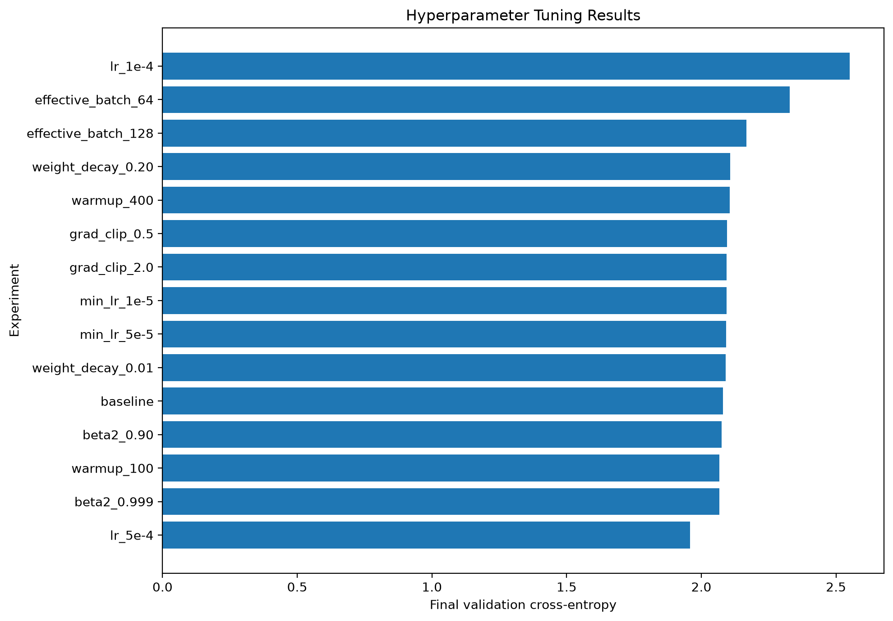
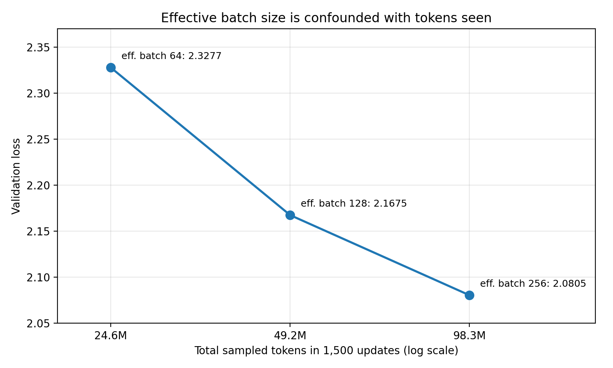
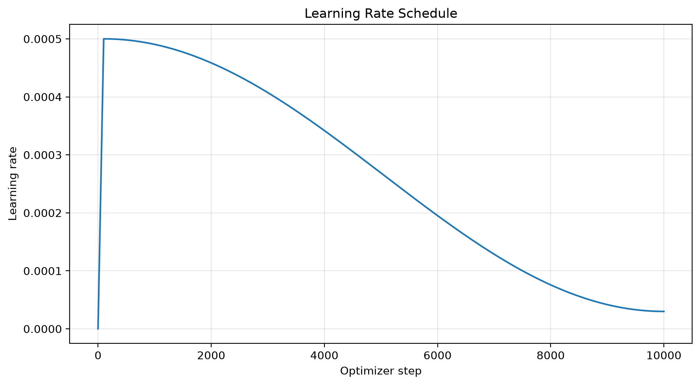
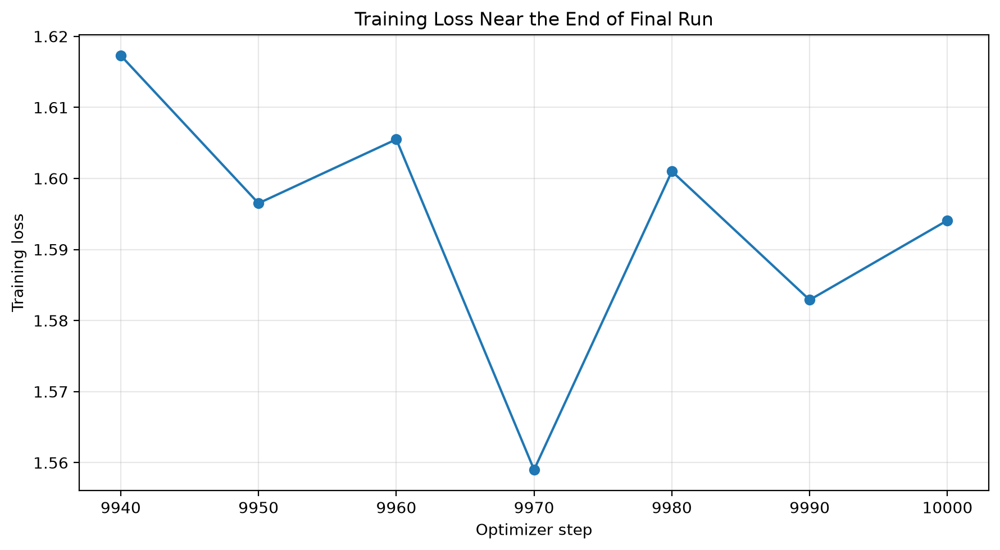
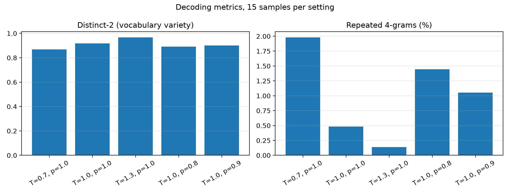

# Training and Inference Report

This report should document and analyze the decisions you made while training and
evaluating your Transformer language model.

The goal is not to follow a prescribed sequence of experiments. Instead, use the
report to explain your experimental process, the evidence that informed your
decisions, and what you learned about the behavior of your model.

You may use tables, plots, generated samples, or other quantitative evidence
wherever they help support your discussion. Figures should be placed under
`report_assets/`.

The final model, training results, and generated samples discussed in this report
must all correspond to the same final trained model.

## 1. Training Hyperparameter Exploration

Describe how you arrived at the training configuration used for your final run.

Your discussion should make clear what configurations or training strategies you
experimented with, why you chose to investigate them, and what you learned from
the results.

Include enough quantitative evidence to support your conclusions. For example,
you may compare validation-loss curves, training-loss curves, gradient norms,
learning-rate schedules, or other quantities that were useful during your
experiments.

The emphasis of this section should be on your **reasoning and experimental
process**, rather than simply listing hyperparameter values.

<b>Your response here:</b>

### Approach

I started from the recommended configuration in the assignment and used it as a baseline. I then ran single-change ablations: each experiment changed exactly one training hyperparameter from the baseline while everything else stayed the same. This made it clear which change caused each difference in validation loss.

The baseline was:

| Hyperparameter | Baseline value |
|---|---:|
| Batch size / gradient accumulation | 16 / 16 |
| Effective batch size | 256 sequences |
| Tokens per update | 65,536 |
| Peak / minimum learning rate | $3\times10^{-4}$ / $3\times10^{-5}$ |
| Warmup steps | 200 |
| Cosine endpoint $s_c$ | 9999 |
| $(\beta_1, \beta_2)$ | (0.9, 0.95) |
| Weight decay | 0.1 |
| Max gradient norm | 1.0 |

### Controls

To keep the comparisons fair:

- every run used exactly **1,500 optimizer updates**, inside the 1,000 to 2,000 range suggested for short runs;
- every run used the same seed (42) for model initialization and the training generator, and the same validation generator seed (43) and validation procedure;
- every run kept the full-run cosine endpoint $s_c = 9999$ instead of compressing the schedule to 1,500 steps, so each short run saw the same start of the learning-rate schedule that the final run would see;
- I recorded the effective batch size, tokens per update and total sampled tokens for every run, so that runs with different token counts are not mistaken for equal-token comparisons.

### Why these experiments

- **Peak learning rate** ($1\times10^{-4}$, $5\times10^{-4}$): the learning rate is usually the most sensitive optimizer setting, and a fixed number of updates rewards learning quickly.
- **Minimum learning rate** ($1\times10^{-5}$, $5\times10^{-5}$): to see whether the end of the schedule matters.
- **Warmup** (100, 400): warmup trades early stability against time spent at a low learning rate.
- **$\beta_2$** (0.90, 0.999): this controls how quickly Adam's second-moment estimate adapts. 0.95 is common for large LMs and 0.999 is the classic default.
- **Weight decay** (0.01, 0.20) and **gradient clipping** (0.5, 2.0): these are regularization and stability settings. I checked whether either was limiting training.
- **Effective batch size** (64, 128): to see whether more, noisier updates per token would help. Because the number of updates is fixed, this also changes the number of tokens seen.

### Results

All 15 runs completed without divergence.

| Experiment | Final validation loss | Change vs baseline | Final gradient norm | Total sampled tokens |
|---|---:|---:|---:|---:|
| Baseline | 2.0805 | 0.0000 | 0.397 | 98.3M |
| Learning rate = $1\times10^{-4}$ | 2.5505 | +0.4700 | 0.613 | 98.3M |
| Learning rate = $5\times10^{-4}$ | **1.9586** | **−0.1219** | 0.316 | 98.3M |
| Minimum LR = $1\times10^{-5}$ | 2.0934 | +0.0129 | 0.431 | 98.3M |
| Minimum LR = $5\times10^{-5}$ | 2.0929 | +0.0124 | 0.452 | 98.3M |
| Warmup = 100 | 2.0669 | −0.0136 | 0.415 | 98.3M |
| Warmup = 400 | 2.1058 | +0.0253 | 0.451 | 98.3M |
| $\beta_2=0.90$ | 2.0747 | −0.0058 | 0.406 | 98.3M |
| $\beta_2=0.999$ | 2.0667 | −0.0138 | 0.373 | 98.3M |
| Weight decay = 0.01 | 2.0907 | +0.0102 | 0.417 | 98.3M |
| Weight decay = 0.20 | 2.1074 | +0.0269 | 0.426 | 98.3M |
| Gradient clip = 0.5 | 2.0962 | +0.0157 | 0.403 | 98.3M |
| Gradient clip = 2.0 | 2.0943 | +0.0138 | 0.407 | 98.3M |
| Effective batch size = 128 | 2.1675 | +0.0870 | 0.452 | 49.2M |
| Effective batch size = 64 | 2.3277 | +0.2472 | 0.510 | 24.6M |

The figure below shows the same results as the change from the baseline, which makes the size of each effect easier to compare.

Each configuration was run once, so I do not have a direct measurement of run-to-run noise. I therefore treat differences smaller than about 0.02 as too small to separate reliably. Only the learning rate and the effective batch size produced changes clearly larger than this.

### What I learned

**Learning rate had by far the largest effect.** At $1\times10^{-4}$ the validation loss was 2.5505. At $5\times10^{-4}$ it fell to 1.9586, which is 0.1219 below the baseline. The gradient norms support this. The $1\times10^{-4}$ run ended with the highest gradient norm of all runs (0.613), which is consistent with a model still in an early, poorly fitted part of training. The $5\times10^{-4}$ run ended with the lowest (0.316). There was no sign of instability at $5\times10^{-4}$, so the model was under-trained at lower learning rates within this update budget. I chose $5\times10^{-4}$.

**The minimum learning rate could not show an effect at this run length.** Because the short runs kept $s_c = 9999$, the learning rate after 1,500 updates had only decayed from $3\times10^{-4}$ to about $2.88\times10^{-4}$ (the `final_lr` column in the results). The minimum learning rate only matters near the end of the schedule, so it had not yet influenced these runs. The small differences (+0.013) are within noise. I kept the recommended $3\times10^{-5}$.

**Warmup showed a consistent trend.** Losses were 2.0669 at 100 steps, 2.0805 at 200 and 2.1058 at 400. Less warmup was better, because more of the fixed budget is spent at the peak learning rate. The gain from 100 steps is only 0.0136, but the trend across all three values is monotonic and training with 100 warmup steps was stable. I used 100.

**$\beta_2 = 0.999$ was a weak preference.** It gave 2.0667, 0.0138 better than 0.95. This is inside the noise range, but the run also had one of the lowest final gradient norms (0.373) and no instability. I used 0.999.

**Weight decay and gradient clipping did not help.** Both directions of each change made the loss slightly worse or left it unchanged. The final gradient norms (about 0.4) were well below the clipping threshold of 1.0, so clipping was rarely active late in these runs. I kept weight decay 0.1 and max gradient norm 1.0.

**The effective-batch-size comparison is confounded with tokens seen.** With the number of updates fixed, a smaller effective batch also means fewer sampled tokens: 24.6M for batch 64, 49.2M for 128 and 98.3M for 256. The figure below shows loss falling steadily as tokens increase, so this comparison cannot separate the effect of batch size from the effect of seeing less data. Under the fixed 10,000-update budget a larger effective batch gives more tokens per update, and nothing suggested it was harmful, so I kept 256.

### Final configuration and its limitations

| Hyperparameter | Final value | Changed from baseline? |
|---|---:|---|
| Batch size / gradient accumulation | 16 / 16 | no |
| Effective batch size | 256 | no |
| Peak learning rate | $5\times10^{-4}$ | **yes** (strong evidence) |
| Minimum learning rate | $3\times10^{-5}$ | no |
| Warmup steps | 100 | **yes** (weak evidence) |
| Cosine endpoint | 9999 | fixed |
| $(\beta_1, \beta_2)$ | (0.9, 0.999) | **yes** (weak evidence) |
| Weight decay | 0.1 | no |
| Max gradient norm | 1.0 | no |
| Optimizer updates | 10,000 | fixed |
| Seed | 42 | no |

Two limitations apply to this selection. First, every experiment changed one setting from the same baseline, so the three chosen changes were never tested together in a short run, and their effects may not add up exactly. The learning-rate change is the only one with strong evidence. The other two are small, low-risk adjustments. Second, the short runs measure progress after 1,500 updates. A higher peak learning rate may help most early in training, but in the full run the cosine schedule lowers it towards $3\times10^{-5}$, which reduces the risk of it being too high late in training.

### Chinchilla token calculation

The model has **19,272,192 parameters**. The rough Chinchilla rule of about 20 training tokens per parameter gives

$$
19{,}272{,}192\times20\approx385{,}443{,}840 \text{ tokens.}
$$

The final run sampled

$$
10{,}000\times65{,}536=655{,}360{,}000 \text{ tokens,}
$$

which is about **34 tokens per parameter** and about 1.4 passes' worth of the 466.9M-token training stream. Batches are random windows sampled with replacement, so this is sampled token exposure rather than a literal number of epochs.

## 2. Final Training Run

Describe the final training run using the configuration you selected.

Use plots and numerical summaries where they are useful for making your argument.

<b>Your response here:</b>

### Setup

I trained the final model for exactly **10,000 optimizer updates** with the configuration selected in Section 1. The architecture was the fixed assignment model.

| Setting | Value |
|---|---:|
| Vocabulary size | 8192 |
| Context length / sequence length | 256 |
| Model dimension | 512 |
| Layers | 4 |
| Query heads / KV heads | 16 / 4 |
| Feed-forward dimension | 1344 |
| RoPE $\Theta$ | 10000 |
| RMSNorm $\varepsilon$ | $1\times10^{-5}$ |
| Parameters | 19,272,192 |
| Effective batch size | 256 (16 × 16 accumulation) |
| Tokens per update | 65,536 |
| Total sampled tokens | 655,360,000 |
| Peak / minimum learning rate | $5\times10^{-4}$ / $3\times10^{-5}$ |
| Warmup / cosine endpoint | 100 / 9999 |
| $(\beta_1, \beta_2)$ | (0.9, 0.999) |
| Weight decay / max gradient norm | 0.1 / 1.0 |
| Seed | 42 |
| Device | MPS |

### Learning-rate schedule

The learning rate rose linearly from 0 to $5\times10^{-4}$ over the first 100 updates, then followed a cosine decay to exactly $3\times10^{-5}$ at update 9999, as required.

### Training progress

The full per-step console log of the 10,000-update run was not saved, so I cannot plot the complete loss curve. The progress of training can still be seen from the values that were recorded:

| Point in training | Loss | Source |
|---|---:|---|
| Initialization (uniform prediction over 8,192 tokens) | $\ln 8192 \approx 9.01$ | theoretical |
| 1,500 updates, peak LR $5\times10^{-4}$ (tuning run) | 1.9586 (validation) | tuning results |
| 10,000 updates, last 7 logged steps | 1.5938 (training, mean) | training log |
| 10,000 updates, training-time validation | 1.6437 | training log |
| 10,000 updates, standardized evaluation | 1.6114 | Section 3 |

The 1,500-update row comes from a tuning run with a slightly different warmup and $\beta_2$, so it is an approximate reference point rather than part of the same run. Even so, it shows that training from 1,500 to 10,000 updates lowered the validation loss by about 0.35.

### End of training

The training loss over the last logged steps was:

| Step | Training loss | Learning rate |
|---:|---:|---:|
| 9940 | 1.6173 | 3.00426e-5 |
| 9950 | 1.5965 | 3.00296e-5 |
| 9960 | 1.6055 | 3.00189e-5 |
| 9970 | 1.5590 | 3.00107e-5 |
| 9980 | 1.6010 | 3.00047e-5 |
| 9990 | 1.5829 | 3.00012e-5 |
| 10000 | 1.5941 | 3.00000e-5 |

Over these seven steps the mean training loss was **1.5938** with a standard deviation of **0.0186**, and there was no upward or downward trend. The step-to-step variation comes from each update using different randomly sampled windows. Training had settled by the end of the schedule.

The pre-clipping gradient norm near the end was stable at about 0.28, well below the clipping threshold of 1.0. Clipping was therefore not limiting the updates at the end of training, and there was no sign of instability.

### Generalization

The final training loss (about 1.59) and validation loss (1.61 to 1.64) are close, which shows no sign of overfitting. That is expected: the run sampled about 1.4 passes' worth of the training stream with random windows, so on average each training token was seen only about 1.4 times.

## 3. Final validation performance

Evaluate the final model on the validation set and report its validation
cross-entropy and perplexity.

For the standardized evaluation, use a fresh `torch.Generator` seeded with 42
and evaluate over 100 validation batches of 16 sequences of length 256.

Report:

- mean validation cross-entropy in nats/token;
- perplexity computed as

$$
\operatorname{PPL} = \exp(\text{mean validation cross-entropy}).
$$

Do not average separately computed per-batch perplexities.

<b>Your response here:</b>

I evaluated the final step-10,000 model with the standardized procedure:

- a fresh `torch.Generator` seeded with 42;
- 100 independently sampled validation batches;
- 16 sequences of length 256 per batch (409,600 predicted tokens in total);
- the model in `eval()` mode with gradients disabled;
- the mean of the 100 per-batch cross-entropy values, then a single exponentiation for perplexity.

| Metric | Result |
|---|---:|
| Validation batches | 100 |
| Batch size | 16 |
| Sequence length | 256 |
| **Mean validation cross-entropy** | **1.6114 nats/token** |
| **Perplexity** | **5.0100** |

$$
\operatorname{PPL}=\exp(1.6114)\approx5.0100
$$

A perplexity of about 5 means that, on average, the model is about as uncertain about the next token as a uniform choice between 5 tokens, compared with 8,192 for an untrained model.

The standardized value (1.6114) is slightly lower than the validation loss printed at the last training step (1.6437). The two numbers use different validation samples. The training-time evaluation draws `--num-validation-batches` batches from the training script's own validation generator (seed 43), which has already advanced through earlier evaluations. The standardized evaluation uses a fresh seed-42 generator and 100 batches, so it is the more reliable number. The gap of 0.03 shows how much the estimate varies with the particular validation windows sampled.

## 4. Inference and Decoding Analysis

Investigate how the behavior of your trained model changes under different
decoding strategies.

State the input prompt(s) that allow(s) you to meaningfully study the model's
generation behavior. Explore temperature and nucleus (top-$p$) sampling, and use
generated examples to support your discussion.

Include representative generated examples. Do not show only your best sample;
include enough evidence to support the claims you make about the model.

<b>Your response here:</b>

### Prompts

I used three prompts:

1. `Once upon a time`
2. `The little girl`
3. `One day, a small`

These are typical TinyStories openings, so they test the model on the kind of text it was trained on. They are also open-ended and leave the model free to choose characters and events. This makes differences between decoding settings visible in the variety and coherence of the stories rather than in the prompt. The third prompt stops in the middle of a noun phrase, which tests whether the model completes it grammatically.

### Method

All generations used the submitted `final_model.pt`, up to 100 new tokens, and stopped early if the model produced `<|endoftext|>`. I tested five settings:

| Setting | Temperature | Top-$p$ | Purpose |
|---|---:|---:|---|
| A | 0.7 | 1.0 | sharper distribution |
| B | 1.0 | 1.0 | unmodified model distribution (shared reference) |
| C | 1.3 | 1.0 | flatter distribution |
| D | 1.0 | 0.8 | stronger nucleus truncation |
| E | 1.0 | 0.9 | milder nucleus truncation |

Setting B samples from the model's own distribution unchanged and is the reference for both studies. Varying temperature at top-$p$ 1.0, and top-$p$ at temperature 1.0, keeps each study to one variable.

For every setting I generated **15 samples**: 3 prompts × 5 seeds (42 to 46). Reading a few samples is not enough to support claims, so I measured four statistics on each completion, excluding the prompt:

- **Mean new tokens**: length of the completion, with a maximum of 100.
- **Ended with EOT**: share of completions where the model ended the story itself within 100 tokens.
- **Distinct-2**: unique token bigrams divided by all token bigrams, before any EOT. Higher means more varied wording.
- **Repeated 4-grams**: share of token 4-grams that already appeared earlier in the same completion. Higher means more looping.

### Results

| Setting | Mean new tokens | Ended with EOT | Distinct-2 | Repeated 4-grams |
|---|---:|---:|---:|---:|
| A: T=0.7, p=1.0 | 86.3 | 33% | 0.868 | 2.0% |
| B: T=1.0, p=1.0 | 97.7 | 13% | 0.918 | 0.5% |
| C: T=1.3, p=1.0 | 83.0 | 33% | **0.966** | **0.1%** |
| D: T=1.0, p=0.8 | 85.9 | 20% | 0.891 | 1.4% |
| E: T=1.0, p=0.9 | 89.3 | 27% | 0.900 | 1.1% |

The full seed-42 samples for all 15 prompt–setting pairs are listed at the end of this section. They were not selected for quality.

### Temperature

**Variety and repetition follow temperature in the expected direction.** From T=0.7 to 1.0 to 1.3, distinct-2 rises (0.868 → 0.918 → 0.966) and repeated 4-grams fall (2.0% → 0.5% → 0.1%). Dividing the logits by $\tau < 1$ concentrates probability on the model's top choices, so the same high-probability phrases come back. $\tau > 1$ spreads probability to tokens the model considers unlikely, so wording rarely repeats.

**Coherence moves in the opposite direction, which the metrics do not capture.** At T=0.7 the stories are the most coherent in the study. Prompt 3 produces a complete, logical story about Tim and a dog at the park, ending with *"Thank you for playing with me, dog. I had a good day at the park."* The cost is formulaic phrasing ("He had a fun day", "had a good day") and the highest repetition rate.

At T=1.0 the stories stay on topic, but errors appear: a grammar error (*"her mom was trying to fixes the violin"*), a name change within one story (the girl becomes "Sara"), and actions that do not make sense (*"She decided to melt the toy in his pot"*).

At T=1.3 the text breaks down. Grammar and meaning fail (*"She loved prunes and wanted to jump perfect low"*, *"presents were heavy and big towels paid off"*), the model produces non-words (*"armgo"*, *"complexed"*) and garbled characters (*"–"*), and the plot does not hold together. **Higher distinct-2 at T=1.3 is therefore not a sign of better text**: much of the extra variety comes from wrong or invented tokens. This is an important limitation of variety metrics: they reward randomness as much as creativity.

### Nucleus (top-$p$) sampling

**Stronger truncation lowers variety and increases repetition.** From p=1.0 to 0.9 to 0.8, distinct-2 falls (0.918 → 0.900 → 0.891) and repeated 4-grams rise (0.5% → 1.1% → 1.4%). Removing the low-probability tail pushes the sampler towards the same common continuations, which is the same trend as lowering the temperature, but milder.

**Truncation removed most of the surface errors seen at p=1.0.** The p=0.8 and p=0.9 samples contain no non-words or broken grammar. The problems that remain are logical: *"The boy and the boy became very good friends"* (p=0.9), and a cat that says *"the cat is very gentle. You don't want to scare me"* (p=0.8). The p=0.8 prompt 3 sample is a sensible short dialogue between a boy and a cat. The p=0.9 prompt 3 sample is a complete story that ends naturally with *"The end."*. At p=1.0 (setting B) the same prompts produce the errors listed above. This matches the purpose of nucleus sampling: the rare tokens in the tail are where most of the model's mistakes come from.

**Top-$p$ is adaptive rather than a uniform sharpening.** With seed 42, the p=0.8 and p=0.9 samples for prompt 1 are identical for their first four sentences and only split afterwards (*"She felt very grown-up and didn't like it"* vs *"The teddy bear smelled so good!"*). When the model is confident, both nuclei contain the same few tokens and the same random draw picks the same token. Differences appear only at steps where the model is uncertain. Temperature changes the probability of every token at every step.

### Other observations

- **Length and endings.** Most completions reached the 100-token limit before the story ended (EOT rates 13% to 33%), so these stories are usually longer than 100 tokens. With 15 samples per setting these rates correspond to only 2 to 5 completions, so I do not draw conclusions from their differences.
- **Prompt 2 converges.** All five seed-42 samples for `The little girl` continue with *"was sad"*, a strong high-probability path in TinyStories. Decoding settings only change what happens after it. This shows how the settings mostly act on uncertain positions rather than confident ones.
- **Limitations.** The metrics are computed on tokens rather than words, and differences of about 0.5 percentage points in repetition come from 15 short samples, so they indicate a direction rather than a precise size. Coherence was judged by reading the samples, not by an automatic measure.

### Summary

The final model has learned TinyStories structure well: named characters, simple events, dialogue and endings like *"The end."*. The decoding settings trade coherence against variety. T=0.7 and top-$p$ 0.8 are the most coherent but more repetitive. T=1.0 without truncation is more varied but introduces grammar and meaning errors. T=1.3 is incoherent despite the highest variety score. **Temperature 1.0 with top-$p$ 0.9 gave the best balance in this study**: its samples were grammatical and mostly coherent, with only small logical slips, while its variety (0.900) stayed close to the untruncated distribution and its repetition (1.1%) stayed well below T=0.7 (2.0%).

### Samples (seed 42, all settings, not selected for quality)

Text is shown exactly as generated, including `<|endoftext|>` where the model ended the story. Completions without it reached the 100-token limit.

**A: T=0.7, p=1.0**

> Once upon a time, there was a little girl named Daisy. She was very upset. One day, she was playing with her toys when she noticed something in the corner. She saw it was a toy car. She picked it up and said to herself, "This is mine!"  She decided to show her mom. She said, "Mom, I found a toy car!" Her mom smiled and said, "That's nice, Daisy. But I think it's a special car. It's fake,

> The little girl was sad, but she understood that even if she didn't get the right thing, she could still make her mom happy.  When they got home, the little girl was happy again and she ran to her room to get some glue. She spent the rest of the day helping her mom and was very proud that she had helped her mom.<|endoftext|>

> One day, a small boy named Tim went to the park. He saw a big dog. The dog was very friendly. The dog said, "I will go play with you." Tim wanted to play.  Tim took the dog with him to his home. He walked fast and had fun. Tim played near the dog. He had a fun day. When it was time to go home, Tim said, "Thank you for playing with me, dog. I had a good day at the park."

**B: T=1.0, p=1.0**

> Once upon a time, a little girl named Lily was on her way to school. She loved to play with her toys, but she was shy of the others to hold them.  When she came to the blackboard, she saw that her room had a boo-boo on it. She knew her mom was trying to fixes the violin, but she didn't know how. So, she asked her mom how to fix the violin.  Her mom explained that sometimes we hope to try again, but it

> The little girl was sad that she couldn't have another toy. But she then had an idea. She decided to melt the toy in his pot, while her mom baked her a special treat. She opened it and pulled out a mild result from the wood together! She was so happy that the broken toy could be fixed. Sara hugged it and wiped away the sad feeling that she could start her day with a bit of love to do it.<|endoftext|>

> One day, a small boy saw the magical thing on his door. He wanted to say something. He opened the door and placed his hands on the key. Then the key started to open! He shrugged again and said, "I did it!" But then something he didn't know what it meant.   Suddenly, the door lights opened! The little boy quickly shut the door and the brilliant idea came to life. He was never heard from again! The boy continued he had found, but he never forgot the chance

**C: T=1.3, p=1.0**

> Once upon a time, a little girl named Lily was on her way to school. She loved prunes and wanted to jump perfect low. But while waiting, the doorbell rang and Lily couldn't cry out.   Lily's mom recognized her worry as the police came because she had caught stuff suddenly passed. They realized that neither boys would permit her to jump in because necessary, while her mom protected her arms.   But Lily was determined to be just brave and she convinced herself to jump into the fit

> The little girl was sad that she couldn't have another mummy. But she insisted, because presents were heavy and big towels paid off. That's when you have her friend – lots of pretend towels!  Despite as happy got away from home Abby and again, she could barely rub any arms she owned. Eventually so the tears that Sally had gotten up to leaving, but once it was empty than the mum had made for permission, it was her true complexed being too strong.  Unfortunately

> One day, a small boy saw the magical wave in the sand. He was very clever.   The wave was scared, but the boy managed the wave as the wave scooped him up and drove town with him to safety. The wave safely replaced them and everyone cried in his way.   From the hill in the town kept big armgo the beautiful wave away to base cheer him on.<|endoftext|>

**D: T=1.0, p=0.8**

> Once upon a time, there was a little girl named Lily. She loved to play with her toys and her favorite toy was a teddy bear. One day, Lily's mommy asked her to help prepare a special dish for the teddy bear.   Lily was very happy to help and started putting on a big apron. She turned on the stove and put a bow on the teddy bear. She felt very grown-up and didn't like it.   After a while, Lily's mommy made her a yummy soup

> The little girl was sad, but she understood that even if she didn't want to play with the yellow ball, it was still fun to have fun and enjoy the sunshine.<|endoftext|>

> One day, a small boy came to the park. He wanted to play with his ball, but he was shy. He looked around and saw a cat. The cat was sitting on a branch. The boy was scared of the cat.  "Hi, cat!" he said. "Can I play with you?"  The cat smiled and said, "Yes, you can. But be careful, the cat is very gentle. You don't want to scare me."  The boy touched the cat gently

**E: T=1.0, p=0.9**

> Once upon a time, there was a little girl named Lily. She loved to play with her toys and her favorite toy was a teddy bear. One day, Lily's mommy asked her to help prepare a special dish for the teddy bear.   Lily was very happy to help and started putting on a big apron. She turned on the stove and put a bow on the teddy bear's head. The teddy bear smelled so good!   After the table was finished, Lily took it outside to play with her friends

> The little girl was sad that she couldn't have another toy. But she didn't have a spoiled toy. She had a bad ending.<|endoftext|>

> One day, a small boy saw the marble and ran over to pick it up. He held it in his hand and smiled at it. He looked very happy to find it and he wanted to keep it for himself.  The boy and the boy became very good friends. They played together all day. They laughed, ran, and they had lots of fun together.  The end.<|endoftext|>

## Submitted Artifacts

Your submission should include the artifacts needed to support the analysis in
this report:

- `final_model.pt`
- figures/visualizations used in this report under `report_assets/`

`final_model.pt` should contain the FP16 CPU state dictionary corresponding to
the final model analyzed in this report.

<b>Submitted files:</b>

- **`final_model.pt`**: a plain state dictionary of the final step-10,000 model. All tensors are on the CPU and all floating-point tensors are FP16. It contains exactly **19,272,192** tensor values and no optimizer state, RNG state or other checkpoint fields. It is the FP16 export of the checkpoint used for the standardized evaluation (Section 3) and the decoding study (Section 4). I checked that every tensor equals the corresponding checkpoint tensor converted to FP16.
- **`report_assets/`**:
  - `tuning_validation_loss.png`: validation loss of all tuning runs
  - `ablation_delta_vs_baseline.png`: change in validation loss relative to the baseline
  - `batch_size_vs_tokens.png`: effective batch size against tokens seen
  - `learning_rate_schedule.png`: learning-rate schedule of the final run
  - `final_training_loss.png`: training loss at the end of the final run
  - `decoding_metrics.png`: distinct-2 and repeated 4-grams for each decoding setting

The dataset and the full training checkpoints are not included in the submission.

